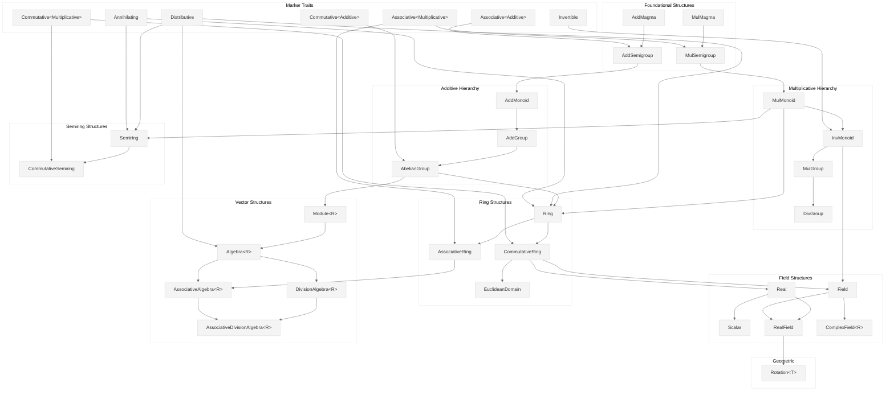

# Algebraic Traits

This document is a reference for the algebraic trait hierarchy in `deep_causality_algebra`. These traits model the structures of abstract algebra, giving a type-safe vocabulary for number systems from the naturals and the integers, through the rationals and the reals, to complex numbers, quaternions, and octonions.

## Trait Hierarchy




---

## Trait Reference

### Marker Traits

These marker traits encode fundamental algebraic properties. They have no methods—implementing them is a compile-time promise that the type satisfies the corresponding law.

| Trait | Law | Formula |
|-------|-----|---------|
| **Associative\<O\>** | Associativity | $(a \circ b) \circ c = a \circ (b \circ c)$ |
| **Commutative\<O\>** | Commutativity | $a \circ b = b \circ a$ |
| **Distributive** | Distributivity | $a \cdot (b + c) = a \cdot b + a \cdot c$ |
| **Annihilating** | Annihilation | $0 \cdot a = a \cdot 0 = 0$ |
| **Invertible** | Field division | $a \cdot a^{-1} = 1$ for $a \neq 0$ |

#### Why two of them name an operation

Associativity and commutativity are properties of a **single** operation, so the law is a statement
about a *pair* — a set together with an operation. ℍ is the case that forces the distinction:
quaternion addition commutes and quaternion multiplication does not, so "ℍ is commutative" is not a
well-formed claim. Only "(ℍ, +) commutes" and "(ℍ, ×) does not" are.

A flat marker cannot say which operation it means, and a type can implement a non-generic trait only
once — so one `Commutative` has exactly one slot where ℍ needs two opposite answers. The operator
parameter gives each law its operation:

```rust
pub trait Operator {}
pub struct Additive;        // whatever `Add` does
pub struct Multiplicative;  // whatever `Mul` does — the DEFAULT
pub struct Combining;       // whatever `Monoid::combine` does
```

`Associative` and `Associative<Multiplicative>` are the same bound, because that is what the flat
marker always meant: every law impl and six of the eight law bounds state the multiplicative case.

`Combining` exists because `Monoid::combine` is neither addition nor multiplication and cannot be
mapped onto either: `Prob::combine` multiplies, `Count::combine` adds, `Conjunction`/`Disjunction`
are `∧` and `∨`. The operation is `combine`, whatever it wraps.

**Distributivity takes no operator.** It *relates* the two operations rather than describing one, so
"multiplication distributes over addition" is the entire statement — there is no additive variant.
The two variants that do exist are **left** ($a(b+c) = ab+ac$) and **right** ($(b+c)a = ba+ca$),
which differ only in non-commutative rings; no type here distinguishes them, and the marker promises
both. `Annihilating` is likewise a two-operation law and takes no operator.

None of the five is blanket-implemented. A blanket over `Num` or `Float` would hand the promise to
any downstream type that happened to meet the structural bound, and a marker whose whole purpose is
to record what the compiler cannot check must not be granted by inference. Each type is listed by
hand, in the crate that defines it.

Two of the five exist because the law they name does not follow from the others:

- **`Annihilating`** is a theorem in a `Ring`: $0 \cdot a = (0 + 0) \cdot a = 0 \cdot a + 0 \cdot a$,
  then cancel. That last step spends an additive inverse, and a `Semiring` has none, so ℕ has to
  promise annihilation separately.
- **`Invertible`** separates a `Field` from a `CommutativeRing` that merely owns a `/` operator.
  `i64` has `Div` and `DivAssign`, but `1 / 5 == 0`, so `5 * (1 / 5) == 0` rather than `1`. Without
  the marker the tower would conclude that ℤ is a field.

**Implementation Guide:**

The five number systems first, then the algebras and containers built over them. `Assoc⟨+⟩` is
`Associative<Additive>`, `Comm⟨×⟩` is `Commutative<Multiplicative>`, and so on.

| Set | Rust Type                | Assoc⟨+⟩ | Comm⟨+⟩ | Assoc⟨×⟩ | Comm⟨×⟩ | Distrib. | Annih. | Invert. | Highest structure |
|:--:|--------------------------|:---:|:---:|:---:|:---:|:---:|:---:|:---:|-----------------|
| ℕ | `u8`…`u128`, `usize`     | ✅ | ✅ | ✅ | ✅ | ✅ | ✅ | ❌ | `CommutativeSemiring` |
| ℤ | `i8`…`i128`, `isize`     | ✅ | ✅ | ✅ | ✅ | ✅ | ✅ | ❌ | `CommutativeRing`, `EuclideanDomain` |
| ℚ | `Rational<T>`            | ✅ | ✅ | ✅ | ✅ | ✅ | ✅ | ✅ | `Field` |
| ℝ | `f32`, `f64`, `Float106` | ✅ | ✅ | ✅ | ✅ | ✅ | ✅ | ✅ | `RealField` |
| ℂ | `Complex<T>`             | ✅ | ✅ | ✅ | ✅ | ✅ | ✅ | ✅ | `Field`, `ComplexField<T>` |
| ℍ | `Quaternion<T>`          | ✅ | ✅ | ✅ | **❌** | ✅ | ✅ | ✅ | `AssociativeDivisionAlgebra` |
| 𝕆 | `Octonion<T>`            | ✅ | ✅ | **❌** | **❌** | ✅ | ✅ | ❌ | `DivisionAlgebra` |
| — | `Dual<T>` = ℝ[ε]         | ✅ | ✅ | ✅ | ✅ | ✅ | ✅ | ❌ | `Real`, `Scalar` |
| — | `CausalTensor<T>`        | ✅ | ✅ | ✅ | ✅ | ✅ | ✅ | ❌ | `CommutativeRing` |
| — | `CausalTensorTrain<T>`   | ✅ | ✅ | ✅ | ✅ | ✅ | ✅ | ❌ | `CommutativeRing` |
| — | `CsrMatrix<T>`           | ✅ | ✅ | ✅ | **❌** | ✅ | ✅ | ❌ | `AbelianGroup` |

Every entry above is conditioned on the element type where the container is generic: `CausalTensor<T>`
promises a law exactly when `T` does.

**The multiplicative column is the one that discriminates.** Every type in the table associates and
commutes additively — abelian addition is what makes any of them a ring in the first place. The
structure is decided by what happens under `×`: ℍ associates but does not commute, 𝕆 does neither,
and `CsrMatrix` matches ℍ because its `Mul` is matrix multiplication.

| Type | Operator | Assoc⟨∘⟩ | Comm⟨∘⟩ | Idempotent | `combine` is |
|------|----------|:---:|:---:|:---:|--------------|
| `Prob` | `Combining` | ✅ | ✅ | ❌ | $p \cdot q$ |
| `Count` | `Combining` | ✅ | ✅ | ❌ | $m + n$ |
| `Conjunction` | `Combining` | ✅ | ✅ | ✅ | $a \wedge b$ |
| `Disjunction` | `Combining` | ✅ | ✅ | ✅ | $a \vee b$ |

---

### Foundational Structures

#### AddMagma
A set with a closed binary addition operation.

```rust
pub trait AddMagma: Add<Output = Self> + AddAssign + Clone + PartialEq {}
```

**Requirements:**
- **Closure:** $a + b \in S$ for all $a, b \in S$

> [!NOTE]
> No associativity or identity is guaranteed at this level.

---

#### MulMagma
A set with a closed binary multiplication operation.

```rust
pub trait MulMagma: Mul<Output = Self> + Clone {}
```

**Requirements:**
- **Closure:** $a \cdot b \in S$ for all $a, b \in S$

Octonions implement `MulMagma` but not `MulMonoid` (non-associative multiplication).

---

### Semigroups

#### AddSemigroup
A set with an associative binary addition operation (no identity required).

```rust
pub trait AddSemigroup: Add<Output = Self> + Associative<Additive> + Clone {}
```

**Laws:**
1. **Closure:** $a + b \in S$
2. **Associativity:** $(a + b) + c = a + (b + c)$

> [!IMPORTANT]
> This bound previously read `Associative`, which — before the marker took an operator — promised
> $(a \cdot b) \cdot c = a \cdot (b \cdot c)$. An additive structure was asserting the
> multiplicative law. Every type it admitted happens to satisfy both, so no wrong type was ever
> admitted, but the bound named the wrong operation and nothing could detect it.

---

#### MulSemigroup
A set with an associative binary multiplication operation (no identity required).

```rust
pub trait MulSemigroup: Mul<Output = Self> + Associative<Multiplicative> + Clone {}
```

**Hierarchy:**
```text
Magma (closure only) → Semigroup (+ associativity) → Monoid (+ identity)
```

---

### Additive Hierarchy

#### AddMonoid
An additive magma with associativity and an identity element.

```rust
pub trait AddMonoid: Add<Output = Self> + AddAssign + Zero + Clone {}
```

**Laws:**
1. **Associativity:** $(a + b) + c = a + (b + c)$
2. **Identity:** $a + 0 = 0 + a = a$

---

#### AddGroup
An additive monoid where every element has an inverse.

```rust
pub trait AddGroup:
    Add<Output = Self> + Sub<Output = Self> + Neg<Output = Self> + Zero + Clone
{
}
```

**Laws:**
1. All `AddMonoid` laws
2. **Inverse:** $a + (-a) = 0$

> [!IMPORTANT]
> `Neg` is load-bearing, and `Sub` alone will not do. `Sub` supplies an operation, not the inverse
> axiom: a truncating implementation satisfies $a - a = 0$ while having no inverses at all. That is
> how `u64` once satisfied `AddGroup` and made `T::zero() - x` return `18446744073709551615`. `Neg`
> is exactly the property separating ℤ from ℕ.

---

#### AbelianGroup
An additive group where addition is commutative.

```rust
pub trait AbelianGroup: AddGroup {}

// Blanket, in `field_real.rs`.
impl<T> AbelianGroup for T where T: Num + Neg<Output = T> + Clone {}
```

**Laws:**
1. All `AddGroup` laws
2. **Commutativity:** $a + b = b + a$

The `Neg` in the blanket keeps the unsigned types out, and with them out of `Ring`,
`CommutativeRing`, and `Field`. `Complex<T>`, `Dual<T>`, `Quaternion<T>`, `Rational<T>`, and the
tensor types carry their own impls, none of them via this blanket.

---

### Multiplicative Hierarchy

#### MulMonoid
A multiplicative magma with associativity and an identity element.

```rust
pub trait MulMonoid: MulMagma + One + Associative<Multiplicative> {}
```

**Laws:**
1. **Associativity:** $(a \cdot b) \cdot c = a \cdot (b \cdot c)$
2. **Identity:** $a \cdot 1 = 1 \cdot a = a$

---

#### InvMonoid
A multiplicative monoid where every element has an inverse.

```rust
pub trait InvMonoid: MulMonoid + Div<Output = Self> + DivAssign {
    fn inverse(&self) -> Self;
}

// The blanket asks for `Invertible` on top of the supertrait bounds.
impl<T> InvMonoid for T
where
    T: MulMonoid + Div<Output = Self> + DivAssign + One + Clone + Invertible,
{
    fn inverse(&self) -> Self {
        T::one() / self.clone()
    }
}
```

**Laws:**
1. All `MulMonoid` laws
2. **Inverse:** $a \cdot a^{-1} = 1$ for $a \neq 0$

> [!IMPORTANT]
> `Div` and `DivAssign` are not enough to reach `InvMonoid`. The blanket also demands
> [`Invertible`](#marker-traits), the promise that `/` really inverts. `i64` has both operators and
> is still not an `InvMonoid`, because `1 / 5 == 0`.

> [!TIP]
> For floating-point types, the inverse of zero returns `Infinity` per IEEE 754.

---

#### MulGroup
Alias for `InvMonoid` with explicit division support.

```rust
pub trait MulGroup: MulMonoid + InvMonoid + Div<Output = Self> + DivAssign {}
```

---

#### DivGroup
Semantic alias for `MulGroup`, representing the group of non-zero elements of a field.

```rust
pub trait DivGroup: MulGroup {}
```

---

### Semiring Structures

A semiring is a ring with the additive inverses removed. It is the structure the natural numbers
have and cannot exceed: `3 - 5` has no value in ℕ, so there is no `-a`, so the additive monoid never
becomes a group. This branch of the tower never rejoins the ring branch.

#### Semiring

```rust
pub trait Semiring:
    Add<Output = Self> + Zero + Clone + MulMonoid + Distributive + Annihilating
{
}
```

**Laws:**
1. **Commutative monoid under $+$:** associative, commutative, identity $0$ — and no inverses
2. **Monoid under $\cdot$:** associative, identity $1$
3. **Distributivity:** $a \cdot (b + c) = a \cdot b + a \cdot c$
4. **Annihilation:** $0 \cdot a = a \cdot 0 = 0$

> [!NOTE]
> The additive side reads `Add + Zero + Clone` rather than `AddMonoid`, and the weakening is
> deliberate. `AddMonoid` also demands `AddAssign<Self>`, which `Ring`'s own `AbelianGroup` bound
> does not, so requiring it here would leave `Semiring` *stronger* than `Ring` on the additive side.
> `CausalTensor` implements `AddAssign<T>` for a scalar right-hand side but never `AddAssign<Self>`,
> and would then have satisfied `Ring` while failing `Semiring`.

Every `Ring` is a `Semiring`, because these bounds are a strict subset of `Ring`'s. `Ring` is
nevertheless not declared as `Ring: Semiring`; the blanket impls already give every ring the weaker
bound, so re-rooting the supertrait would change nothing about membership.

---

#### CommutativeSemiring

```rust
pub trait CommutativeSemiring: Semiring + Commutative<Multiplicative> {}
```

**Additional Law:**
- $a \cdot b = b \cdot a$

Exactly the structure of ℕ, and the highest rung the unsigned integers reach. The step from here to
`CommutativeRing` is `Neg`, which is why `assert_commutative_semiring::<u64>()` compiles and
`assert_commutative_ring::<u64>()` does not.

---

### Ring Structures

#### Ring
An abelian group under addition combined with a monoid under multiplication, satisfying distributivity.

```rust
pub trait Ring: AbelianGroup + MulMonoid + Distributive + Annihilating {}
```

**Laws:**
1. $(R, +)$ is an `AbelianGroup`
2. $(R, \cdot)$ is a `MulMonoid`
3. $a \cdot (b + c) = a \cdot b + a \cdot c$ (left distributivity)
4. $(a + b) \cdot c = a \cdot c + b \cdot c$ (right distributivity)
5. $0 \cdot a = a \cdot 0 = 0$ (annihilation)

> [!NOTE]
> Annihilation is derivable in a ring, but it is still required as a marker so that `Ring` and
> `Semiring` present the same surface and generic semiring code accepts ℤ and ℕ alike.

---

#### AssociativeRing
A ring where multiplication is explicitly marked as associative.

```rust
pub trait AssociativeRing: Ring + Associative<Multiplicative> {}
```

> [!NOTE]
> All `Ring` types in this crate are associative by construction (via `MulMonoid`).

---

#### CommutativeRing
A ring where multiplication is commutative.

```rust
pub trait CommutativeRing: Ring + Commutative<Multiplicative> {}
```

**Additional Law:**
- $a \cdot b = b \cdot a$

---

#### EuclideanDomain
A commutative ring carrying a Euclidean function, so that division with remainder — and therefore
the Euclidean algorithm — is well defined. This is the rung at which exact integer arithmetic lives.

```rust
pub trait EuclideanDomain: CommutativeRing {
    type EuclideanValue: Ord;

    fn euclidean_fn(&self) -> Self::EuclideanValue;
    fn div_euclid(&self, other: &Self) -> Self;
    fn rem_euclid(&self, other: &Self) -> Self;
    fn normalize(&self) -> Self;

    // Provided, on top of the four above.
    fn gcd(&self, other: &Self) -> Self;
    fn lcm(&self, other: &Self) -> Self;
}
```

**Laws:** there is a function $\varphi: R \setminus \{0\} \to \mathbb{N}$ such that for any
$a, b \in R$ with $b \neq 0$ there exist $q, r$ with $a = b \cdot q + r$, and either $r = 0$ or
$\varphi(r) < \varphi(b)$. For ℤ, $\varphi(n) = |n|$.

Implementing it also promises the **integral domain** axioms, which the compiler cannot check:
$1 \neq 0$, and no zero divisors ($a \cdot b = 0$ implies $a = 0$ or $b = 0$). The absence of zero
divisors is what licenses cancellation, and therefore what makes exact elimination over the ring
well defined.

**Implemented for:** `i8`, `i16`, `i32`, `i64`, `i128`, `isize`.

> [!NOTE]
> The unsigned types are absent by construction, not by oversight: ℕ has no additive inverses, so it
> is not an `AbelianGroup`, so it is not a `CommutativeRing` and cannot reach this trait at all. A
> Euclidean domain is a *ring* first, and ℕ is only a semiring. `ℤ/6ℤ` is excluded for the other
> reason — it is a commutative ring, but $2 \cdot 3 = 0$.

---

### Field Structures

#### Field
A commutative ring where every non-zero element has a multiplicative inverse.

```rust
pub trait Field: CommutativeRing + InvMonoid + Div<Output = Self> + DivAssign {}
```

**Key Property:**
- Division is well-defined for all non-zero elements

**Examples:** `f32`, `f64`, `Complex<T>`

---

#### Real
The analytic real interface: a commutative ring with ordering, negation, and the elementary
functions — but **without** requiring field division. Splitting `Real` out of `RealField` lets
non-field reals carry the same analytic API; the load-bearing case is `Dual<T>`, whose `ε` is a
zero divisor (it is **not** a field, yet it is `Real`).

```rust
pub trait Real:
    CommutativeRing + PartialOrd + Neg<Output = Self> + Copy + Clone + AddAssign + SubAssign + MulAssign
{
    fn sqrt(self) -> Self;
    fn exp(self) -> Self;
    fn ln(self) -> Self;
    fn sin(self) -> Self;
    fn cos(self) -> Self;
    fn pi() -> Self;
    fn e() -> Self;
    fn epsilon() -> Self;
    // ... and the rest of the elementary functions
}
```

---

#### Scalar
The differentiation/integration scalar: a `Real` with division that need **not** be a field.

```rust
pub trait Scalar: Real + Div<Output = Self> + FromPrimitive {}
```

**Position in the tower:** between `Real` and `RealField`. It adds `Div` to `Real`, but unlike a
`Field`/`RealField` it does **not** require a total inverse — so `Dual<T>` qualifies (`ε` is a zero
divisor: division exists, yet it is not a field).

**Why each bound:**
- `Real` — ring arithmetic and the elementary functions (the analytic axis), without field division.
- `Div` — lets `Dual` itself be `Real`, so the tangent functor **nests** (`Dual<Dual<…>>` gives
  higher derivatives).
- `FromPrimitive` — the precision-safe constant lift: a model raises its literal constants into the
  working scalar at any precision (`f32` / `f64` / `Float106`, and `Dual` over each). `From<f64>` is
  deliberately *not* used, because `f32` does not implement it.

Blanket-implemented, so every qualifying number is a `Scalar` automatically.
`deep_causality_calculus` writes its differentiation and integration operators against `Scalar`, so
a single model evaluates at `f64` (the value) and at `Dual` (the derivative).

**Examples:** `f32`, `f64`, `Float106`, and `Dual<T>` for any `Scalar` `T`.

---

#### RealField
A real that is also a field: the analytic real (`Real`) intersected with field division.

```rust
pub trait RealField: Real + Field {}
```

`RealField` adds nothing of its own — it is exactly the reals that are fields. The ordering,
transcendentals (`sin`, `cos`, `exp`, `ln`, `sqrt`, …), and constants (`pi()`, `e()`, `epsilon()`)
come from `Real`; total division comes from `Field`. `f32` / `f64` are `RealField`; `Dual<T>` is
`Real` / `Scalar` but **not** `RealField` (no total inverse).

---

#### ComplexField\<R\>
A field extension over the reals with complex conjugation and component access.

```rust
pub trait ComplexField<R: Field>: Field {
    fn real(&self) -> R;
    fn imag(&self) -> R;
    fn conjugate(&self) -> Self;
    fn norm_sqr(&self) -> R;
    fn norm(&self) -> R;
    fn arg(&self) -> R;
    fn from_re_im(re: R, im: R) -> Self;
    fn i() -> Self;
}
```

**Properties:**
- **Conjugation:** $(z^*)^* = z$, $(zw)^* = z^* w^*$
- **Norm:** $|z|^2 = z \cdot z^*$
- **Decomposition:** $z = \text{re}(z) + i \cdot \text{im}(z)$

> [!NOTE]
> Quaternions and Octonions are NOT complex fields (non-commutative/non-associative).
> They implement `DivisionAlgebra` instead.

---

### Vector Structures

#### Module<R>
A generalization of vector spaces over a ring (not necessarily a field).

```rust
pub trait Module<R: Ring>: AbelianGroup + Mul<R, Output = Self> + MulAssign<R> {
    fn scale(&self, scalar: R) -> Self;
    fn scale_mut(&mut self, scalar: R);
}
```

**Laws (for scalars $r, s \in R$ and vectors $x, y \in M$):**
1. $r \cdot (x + y) = r \cdot x + r \cdot y$
2. $(r + s) \cdot x = r \cdot x + s \cdot x$
3. $(r \cdot s) \cdot x = r \cdot (s \cdot x)$
4. $1 \cdot x = x$

---

#### Algebra<R>
A module equipped with a bilinear product (not necessarily associative).

```rust
pub trait Algebra<R: Ring>: Module<R> + Mul<Output = Self> + MulAssign + One + Distributive {
    fn sqr(&self) -> Self;
}
```

**Requirements:**
- Unital (has multiplicative identity `1`)
- Distributive
- **Not** necessarily associative (allows Octonions)

---

#### AssociativeAlgebra<R>
An algebra where multiplication is associative.

```rust
pub trait AssociativeAlgebra<R: Ring>: Algebra<R> + AssociativeRing {}
```

**Examples:** Real, Complex, Quaternion algebras

---

#### DivisionAlgebra<R>
An algebra where every non-zero element has a multiplicative inverse.

```rust
pub trait DivisionAlgebra<R: Field>: Algebra<R> {
    fn conjugate(&self) -> Self;
    fn norm_sqr(&self) -> R;
    fn inverse(&self) -> Self;
}
```

**Properties:**
- **Conjugate:** $(a^*)^* = a$, $(ab)^* = b^* a^*$
- **Norm:** $\|a\|^2 = a \cdot a^*$
- **Inverse:** $a^{-1} = a^* / \|a\|^2$

> [!IMPORTANT]
> Octonions are `DivisionAlgebra` but **not** `AssociativeAlgebra`.

---

#### AssociativeDivisionAlgebra<R>
A division algebra with associative multiplication.

```rust
pub trait AssociativeDivisionAlgebra<R: Field>: DivisionAlgebra<R> + AssociativeAlgebra<R> {}
```

**Examples:** `f32`, `f64`, `Complex<T>`, `Quaternion<T>`

---

### Geometric Traits

#### Rotation<T>
Trait for types that can perform 3D rotations (or Bloch sphere rotations).

```rust
pub trait Rotation<T: RealField> {
    fn rotate_x(&self, angle: T) -> Self;
    fn rotate_y(&self, angle: T) -> Self;
    fn rotate_z(&self, angle: T) -> Self;
    fn global_phase(&self, angle: T) -> Self;
}
```

**Correspondences:**
| Axis | Quaternion | Quantum (Pauli) |
|------|------------|-----------------|
| X | $i$ | $\sigma_x$ |
| Y | $j$ | $\sigma_y$ |
| Z | $k$ | $\sigma_z$ |

---

## Type Examples

The concrete number types implement these traits in their own crates: `Complex`, `Quaternion`, and `Octonion` live in
`deep_causality_num_complex`; `Dual` lives in `deep_causality_num_dual`; `Rational` lives in `deep_causality_num_rational`.

The primitive integers *are* part of this hierarchy — signed types reach `CommutativeRing` and
`EuclideanDomain`, unsigned types reach `CommutativeSemiring`. What lives in `deep_causality_num`
instead is the set-named vocabulary: `NaturalNumber` for ℕ, and `Integer` / `SignedInt` /
`UnsignedInt` for the machine widths. Those traits state the *operations* of each set; the traits
here state the *laws*. `NaturalNumber` carries the gcd for the unsigned types, because ℕ is not a
ring and so cannot reach `EuclideanDomain`, where the signed gcd lives.

| Type | Primary Traits |
|------|----------------|
| `f32`, `f64`, `Float106` | `RealField`, `Real`, `Scalar`, `Field`, `DivisionAlgebra<Self>` |
| `i8`…`i128`, `isize` | `CommutativeRing`, `EuclideanDomain` (not a `Field`: `1 / 5` is `0`) |
| `u8`…`u128`, `usize` | `CommutativeSemiring` (not a `Ring`: ℕ has no additive inverses) |
| `Rational<T>` | `Field` (not a `Real`: there is no rational `sqrt(2)`) |
| `Dual<T>` | `Real`, `Scalar` (a non-field: `ε` is a zero divisor) |
| `Complex<T>` | `Field`, `ComplexField<T>`, `DivisionAlgebra<T>`, `Rotation<T>` |
| `Quaternion<T>` | `AssociativeRing`, `DivisionAlgebra<T>`, `Rotation<T>` |
| `Octonion<T>` | `DivisionAlgebra<T>` (non-associative) |
