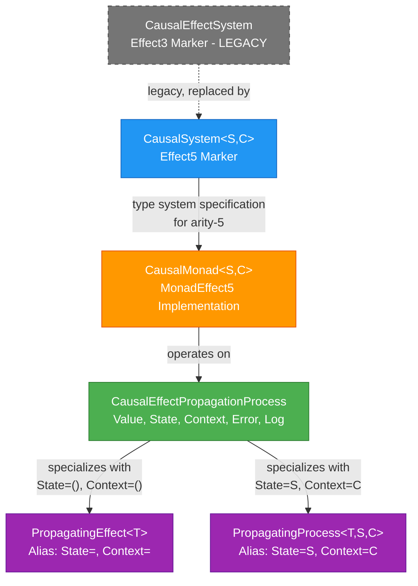

# Deep Causality Core: Type System Analysis Report

## Executive Summary

This report provides a comprehensive analysis of the core type system in `deep_causality_core`, focusing on the monadic architecture for causal effect propagation. The system implements a Higher-Kinded Type (HKT) based design using arity-5 fixed-effect monads to handle stateful, context-aware causal computations with robust error handling and comprehensive logging.

---

## Core Types Overview

### 1. CausalEffectPropagationProcess

**Location**: `deep_causality_core/src/types/causal_effect_propagation_process/mod.rs`

**Definition**:
```rust
pub struct CausalEffectPropagationProcess<Value, State, Context, Error, Log> {
    pub value: EffectValue<Value>,
    pub state: State,
    pub context: Option<Context>,
    pub error: Option<Error>,
    pub logs: Log,
}
```

**Purpose**: This is the **foundational container type** for all monadic effects in the Deep Causality framework. It represents the complete state of a causal computation at any point in time.

**Key Features**:
- **Arity-5 Generic Structure**: Five independent type parameters allow maximum flexibility
- **Value Container**: Holds the current computation value via `EffectValue<Value>`
- **Stateful**: Carries mutable state `State` through computation chains
- **Context-Aware**: Optional `Context` for additional environmental information
- **Error Handling**: Optional `Error` for failure propagation
- **Audit Trail**: `Log` accumulates a complete history of operations

**Core Methods**:

1. **`bind<F, NewValue>(...)`**: 
   - Primary method for building Markovian process chains
   - Chains stateful, context-aware computations
   - Short-circuits on error, preserving error state and logs
   - Function `f` receives `(value, state, context)` from previous step
   - Implements the monadic bind operation for stateful processes

2. **`with_state(...)`**:
   - Lifts a stateless effect into a stateful process
   - Provides initial state and context
   - Entry point for starting stateful computation chains from simple effects

**HKT Implementation**: Uses `CausalEffectPropagationProcessWitness<S, C, E, L>` to implement `HKT5`, `HKT`, `Functor`, `Applicative`, and `Monad` traits.

---

### 2. PropagatingEffect

**Location**: `deep_causality_core/src/types/propagating_effect/mod.rs`

**Definition**:
```rust
pub type PropagatingEffect<T> =
    CausalEffectPropagationProcess<T, (), (), CausalityError, EffectLog>;
```

**Purpose**: A **type alias** specializing `CausalEffectPropagationProcess` for **stateless** causal effects.

**Characteristics**:
- **Stateless**: `State = ()`
- **No Context**: `Context = ()`
- **Fixed Error Type**: `Error = CausalityError`
- **Fixed Log Type**: `Log = EffectLog`
- **Simplicity**: Ideal for simple, functional-style causal computations without state management

**Use Case**: When you need monadic composition with error handling and logging but don't require state or context propagation.

**HKT Witness**: `PropagatingEffectWitness<E, L>` implements the standard monadic operations (`Functor`, `Applicative`, `Monad`) for this specialization.

---

### 3. PropagatingProcess

**Location**: `deep_causality_core/src/types/propagating_process/mod.rs`

**Definition**:
```rust
pub type PropagatingProcess<T, S, C> =
    CausalEffectPropagationProcess<T, S, C, CausalityError, EffectLog>;
```

**Purpose**: A **type alias** specializing `CausalEffectPropagationProcess` for **stateful** causal processes with optional context.

**Characteristics**:
- **Stateful**: Generic `State = S`
- **Context-Aware**: Generic `Context = C`
- **Fixed Error Type**: `Error = CausalityError`
- **Fixed Log Type**: `Log = EffectLog`
- **Complexity**: Suitable for complex causal computations requiring state management

**Use Case**: When you need to maintain and propagate state through causal computation chains, such as tracking accumulated evidence, environmental conditions, or system parameters.

**HKT Witness**: `PropagatingProcessWitness<S, C>` implements the monadic operations with state and context handling.

---

### 4. CausalEffectSystem

**Location**: `deep_causality_core/src/types/causal_effect_system/mod.rs`

**Definition**:
```rust
pub struct CausalEffectSystem;

impl Effect3 for CausalEffectSystem {
    type Fixed1 = CausalityError;
    type Fixed2 = EffectLog;
    type HktWitness = PropagatingEffectWitness<Self::Fixed1, Self::Fixed2>;
}
```

**Purpose**: A **marker struct** implementing the `Effect3` trait from `deep_causality_haft`. This appears to be a **legacy type** from an earlier arity-3 design.

**Status**: **LIKELY DEPRECATED** - This uses the older `Effect3` trait, which has been superseded by `Effect5` in the current architecture.

**Original Intent**: Declared fixed types for error (`CausalityError`) and log (`EffectLog`) components in the monadic context, linking to `PropagatingEffectWitness`.

**Recommendation**: This type appears to be **no longer needed** in the current arity-5 architecture. It should be reviewed for removal or updated to modern patterns.

---

### 5. CausalSystem

**Location**: `deep_causality_core/src/types/causal_system/mod.rs`

**Definition**:
```rust
pub struct CausalSystem<S, C>(PhantomData<(S, C)>);

impl<S, C> Effect5 for CausalSystem<S, C>
where
    S: Clone + Default,
    C: Clone,
{
    type Fixed1 = S;
    type Fixed2 = C;
    type Fixed3 = CausalityError;
    type Fixed4 = EffectLog;
    type HktWitness = CausalEffectPropagationProcessWitness<
        Self::Fixed1,
        Self::Fixed2,
        Self::Fixed3,
        Self::Fixed4,
    >;
}
```

**Purpose**: A **marker struct** implementing the `Effect5` trait, representing the **modern arity-5 effect system**.

**Key Differences from CausalEffectSystem**:
- Uses `Effect5` instead of `Effect3`
- Parameterized by `State` and `Context` types
- Declares all five fixed types: `State`, `Context`, `Error`, `Log`, plus the implicit `Value`
- Links to `CausalEffectPropagationProcessWitness` (not the older `PropagatingEffectWitness`)

**Relationship**: This **replaces** `CausalEffectSystem` as the primary effect system marker for modern causal computations.

**Usage**: Provides the type-level specification that `CausalMonad` operates over.

---

### 6. CausalMonad

**Location**: `deep_causality_core/src/types/causal_monad/mod.rs`

**Definition**:
```rust
pub struct CausalMonad<S = (), C = ()>(PhantomData<(S, C)>);

impl<S, C> MonadEffect5<CausalSystem<S, C>> for CausalMonad<S, C>
where
    S: Clone + Default,
    C: Clone,
    <CausalSystem<S, C> as Effect5>::HktWitness:
        Functor<<CausalSystem<S, C> as Effect5>::HktWitness> + Sized,
{
    fn pure<T>(value: T) -> CausalEffectPropagationProcess<T, S, C, CausalityError, EffectLog> { ... }
    
    fn bind<T, U, Func>(
        process: CausalEffectPropagationProcess<T, S, C, CausalityError, EffectLog>,
        f: Func,
    ) -> CausalEffectPropagationProcess<U, S, C, CausalityError, EffectLog> { ... }
}
```

**Purpose**: The **concrete implementation** of monadic operations (`pure` and `bind`) for the `CausalSystem`.

**Operations**:

1. **`pure(value)`**: 
   - Lifts a plain value into the monadic context
   - Creates a `CausalEffectPropagationProcess` with:
     - `value` wrapped in `EffectValue::Value`
     - Default state
     - No context, no error
     - Empty log

2. **`bind(process, f)`**:
   - Chains computations
   - **Error short-circuiting**: If `process` contains error, propagates it without executing `f`
   - **Success path**: Extracts value, applies `f`, merges logs
   - **State/Context preservation**: Carries state and context through the chain

**Special Feature**: Also implements `Intervenable` trait, allowing causal interventions:
```rust
fn intervene<T>(effect: ..., new_value: T) -> ...
```
This enables replacing values mid-computation while logging the intervention.

---

## Type Relationships



### Hierarchy Summary

1. **Foundation**: `CausalEffectPropagationProcess` is the universal container
2. **Specializations**: `PropagatingEffect` and `PropagatingProcess` are convenient aliases
3. **Type System**: `CausalSystem<S, C>` declares the effect system structure
4. **Operations**: `CausalMonad<S, C>` provides the actual monadic operations
5. **Legacy**: `CausalEffectSystem` is the old arity-3 version (likely deprecated)

---

## PropagatingEffect vs PropagatingProcess: Detailed Comparison

### Fundamental Difference

The core distinction is **statefulness**:

| Aspect | PropagatingEffect | PropagatingProcess |
|--------|-------------------|-------------------|
| **State Type** | `()` (unit, stateless) | Generic `S` (stateful) |
| **Context Type** | `()` (no context) | Generic `C` (contextual) |
| **Complexity** | Simple, functional | Complex, stateful |
| **Use Case** | Pure transformations | State machines, accumulation |

### Detailed Comparison

#### PropagatingEffect Monad

**Type Signature**:
```rust
PropagatingEffect<T> = CausalEffectPropagationProcess<T, (), (), CausalityError, EffectLog>
```

**Characteristics**:
- **Purely Functional**: No mutable state between operations
- **Memoryless**: Each computation depends only on its immediate input
- **Simpler Error Model**: Errors and logs are the only "side effects"
- **Composition**: Chains via `bind` where each step is independent

**Example Use Cases**:
- Data transformations in a pipeline
- Validation chains
- Simple causal inference without memory
- Functional error handling with audit trails

**HKT Witness**: `PropagatingEffectWitness<E, L>`
- Implements `Functor`, `Applicative`, `Monad`
- Generic over Error and Log types only

#### PropagatingProcess Monad

**Type Signature**:
```rust
PropagatingProcess<T, S, C> = CausalEffectPropagationProcess<T, S, C, CausalityError, EffectLog>
```

**Characteristics**:
- **Stateful**: Maintains `State` across computation steps
- **Context-Aware**: Can access and propagate `Context` information
- **Memory-Based**: Previous states influence future computations
- **Complex Modeling**: Can represent systems with history dependency

**Example Use Cases**:
- Bayesian inference with evolving beliefs (state = probability distributions)
- Causal reasoning with accumulating evidence (state = evidence set)
- Time-series analysis with temporal context (state = historical data)
- Environmental simulations (context = environmental parameters)

**HKT Witness**: `PropagatingProcessWitness<S, C>`
- Implements `Functor`, `Applicative`, `Monad`
- Generic over State and Context types
- Error and Log are fixed to `CausalityError` and `EffectLog`

### Key Implementation Differences

#### Bind Operation

**PropagatingEffect**:
```rust
fn bind<A, B>(m_a: PropagatingEffect<A>, f: Func) -> PropagatingEffect<B>
where Func: FnMut(A) -> PropagatingEffect<B>
{
    // f receives only the value A
    // State and Context are always ()
}
```

**PropagatingProcess**:
```rust
fn bind<A, B>(m_a: PropagatingProcess<A, S, C>, f: Func) -> PropagatingProcess<B, S, C>
where Func: FnMut(A) -> PropagatingProcess<B, S, C>
{
    // f receives value A
    // State is passed through: m_a.state -> result.state
    // Context is preserved: m_a.context -> result.context
}
```

**Critical Note**: In the current `PropagatingProcessWitness::bind` implementation, state is **passed through** but not updated by `f`. For Markovian processes where state should evolve, use `CausalEffectPropagationProcess::bind` directly, which allows `f` to receive and modify state.

---

## Markovian vs Non-Markovian Properties

### Definition of Markovian Property

A process is **Markovian** if its future state depends only on its current state, not on the sequence of states that preceded it. Formally:

**Markov Property**: `P(X_{t+1} | X_t, X_{t-1}, ..., X_0) = P(X_{t+1} | X_t)`

The future is conditionally independent of the past given the present.

### In the Deep Causality Context

#### Markovian Processes

The codebase explicitly references Markovian processes in `CausalEffectPropagationProcess::bind`:

```rust
/// This is the primary method for building Markovian process chains, as the
/// function `f` receives the value, state, and context from the previous step.
pub fn bind<F, NewValue>(self, f: F) -> CausalEffectPropagationProcess<...>
where
    F: FnOnce(EffectValue<Value>, State, Option<Context>) -> CausalEffectPropagationProcess<...>
```

**Key Insight**: The `bind` method enables Markovian processes because:
1. Function `f` receives the **current state** (`State`)
2. Function `f` receives the **current value** (`EffectValue<Value>`)
3. Function `f` receives the **current context** (`Option<Context>`)
4. Function `f` **returns a new process** with updated state

This design allows each step to depend on the present state without needing explicit access to historical states (though history is implicitly available through the log if needed for non-Markovian extensions).

#### Supporting Markovian Property

**State as Sufficient Statistic**: In a proper Markovian process:
- The `State` type should contain all information needed for future evolution
- Context provides environmental parameters
- Logs provide audit trail but shouldn't be required for computation

**Example Markovian Use**:
```rust
// State = (current_position, velocity)
// Each step computes next state from current state only
let process = CausalEffectPropagationProcess::pure(initial_value)
    .bind(|val, state, ctx| {
        // Compute next_state from (val, state, ctx) only
        // No need to look at historical states
        compute_next_step(val, state, ctx)
    })
    .bind(|val, state, ctx| {
        // Again, only current state matters
        compute_another_step(val, state, ctx)
    });
```

#### Non-Markovian Extensions

While the architecture is designed for Markovian processes, **non-Markovian processes can be supported** by:

1. **Encoding History in State**:
   ```rust
   // State = Vec<PreviousState> or linked history structure
   struct NonMarkovianState {
       current: CurrentState,
       history: Vec<HistoricalState>,
   }
   ```

2. **Using Logs for Historical Analysis**:
   - The `Log` field accumulates complete history
   - Post-processing can analyze the log for historical dependencies
   - However, logs are meant for audit, not computation

3. **Context as Historical Memory**:
   - Context could encode relevant history
   - Less elegant but possible for limited historical dependencies

### Design Philosophy

**Primary Target**: Markovian processes for efficiency and mathematical tractability

**Flexibility**: Non-Markovian processes possible but require explicit encoding of history in state

**Separation of Concerns**:
- **State**: Computational memory (should be sufficient for Markov property)
- **Context**: Environmental parameters (usually static or slowly varying)
- **Logs**: Audit trail (for explanation and debugging, not primary computation)

---

## Summary and Recommendations

### Current Architecture Status

#### Active Types (Use These)
1. **`CausalEffectPropagationProcess<Value, State, Context, Error, Log>`** - Core container
2. **`PropagatingEffect<T>`** - For stateless computations
3. **`PropagatingProcess<T, S, C>`** - For stateful computations
4. **`CausalSystem<S, C>`** - Modern effect system marker (arity-5)
5. **`CausalMonad<S, C>`** - Monadic operations implementation

#### Deprecated/Legacy Types (Review for Removal)
1. **`CausalEffectSystem`** - Old arity-3 system, likely no longer needed

### Architectural Insights

1. **Unified Foundation**: All monadic types are built on `CausalEffectPropagationProcess`
2. **Type Aliases for Convenience**: `PropagatingEffect` and `PropagatingProcess` simplify common cases
3. **HKT-Based Design**: Enables generic programming over different effect types
4. **Arity-5 System**: Modern architecture supports `(Value, State, Context, Error, Log)`
5. **Markovian by Design**: Built for efficient state-based computations

### Key Design Decisions

1. **Separation of Stateless/Stateful**: Clear distinction via type aliases
2. **Error Short-Circuiting**: Automatic error propagation without explicit checks
3. **Log Accumulation**: Comprehensive audit trail for explainability
4. **State Propagation**: Designed for Markovian processes but extensible

### Usage Guidelines

**Choose `PropagatingEffect` when**:
- No state needed between steps
- Pure functional transformations
- Simple error handling and logging

**Choose `PropagatingProcess` when**:
- Need to maintain state across steps
- Building Markovian processes
- Require context-aware computations

**Use `CausalEffectPropagationProcess` directly when**:
- Need full control over all five type parameters
- Building Non-Markovian processes
- Implementing custom monadic operations
- Building advanced abstractions

### Open Questions for Review

1. **CausalEffectSystem Removal**: Confirm this legacy type can be deleted
2. **State Evolution Semantics**: Should `PropagatingProcessWitness::bind` allow `f` to modify state, or is pass-through intentional?
3. **Non-Markovian Support**: Should there be explicit support/documentation for non-Markovian processes?
4. **Context Mutability**: Should context be mutable or always passed through unchanged?

---

## Conclusion

The `deep_causality_core` type system implements a HKT-based monadic architecture for causal effect propagation. The design elegantly handles the spectrum from simple stateless transformations to complex stateful Markovian processes, all while maintaining robust error handling and comprehensive logging. The arity-5 system (`CausalSystem` and `CausalMonad`) represents the modern, mature architecture, while `CausalEffectSystem` appears to be a legacy remnant from earlier iterations.

The distinction between `PropagatingEffect` and `PropagatingProcess` is clear and purposeful: statelessness versus statefulness. Both are specializations of the unified `CausalEffectPropagationProcess` container to provide both flexibility and convenience.
