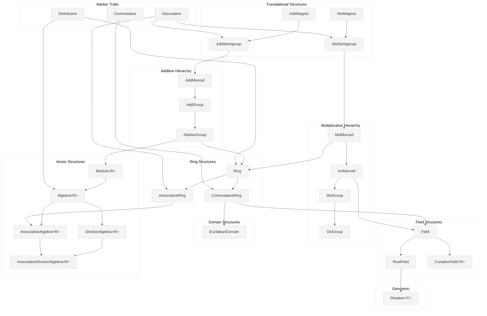

# Algebraic Traits

This document provides a comprehensive reference for the algebraic trait hierarchy in `deep_causality_num`. These traits model rigorous mathematical structures from abstract algebra, enabling type-safe representation of number systems from basic integers to complex numbers and quaternions.

## Trait Hierarchy




---

## Trait Reference

### Marker Traits

These marker traits encode fundamental algebraic properties. They have no methods—implementing them is a compile-time promise that the type satisfies the corresponding law.

| Trait | Law | Formula |
|-------|-----|---------|
| **Associative** | Associativity | $(a \cdot b) \cdot c = a \cdot (b \cdot c)$ |
| **Commutative** | Commutativity | $a \cdot b = b \cdot a$ |
| **Distributive** | Distributivity | $a \cdot (b + c) = a \cdot b + a \cdot c$ |

**Implementation Guide:**

| Type | Distributive | Associative | Commutative | Resulting Trait |
|------|:---:|:---:|:---:|-----------------|
| Real (`f32`, `f64`) | ✅ | ✅ | ✅ | `Field` |
| Complex | ✅ | ✅ | ✅ | `Field` |
| Quaternion | ✅ | ✅ | ❌ | `AssociativeRing` |
| Octonion | ✅ | ❌ | ❌ | `DivisionAlgebra` |
| Matrix | ✅ | ✅ | ❌ | `AssociativeRing` |

---

### Foundational Structures

#### AddMagma
A set with a closed binary addition operation.

```rust
pub trait AddMagma: Add<Output = Self> + AddAssign + Clone + PartialEq {}
```

**Requirements:**
- **Closure:** $a + b \in S$ for all $a, b \in S$

> [!NOTE]
> No associativity or identity is guaranteed at this level.

---

#### MulMagma
A set with a closed binary multiplication operation.

```rust
pub trait MulMagma: Mul<Output = Self> + Clone {}
```

**Requirements:**
- **Closure:** $a \cdot b \in S$ for all $a, b \in S$

Octonions implement `MulMagma` but not `MulMonoid` (non-associative multiplication).

---

### Semigroups

#### AddSemigroup
A set with an associative binary addition operation (no identity required).

```rust
pub trait AddSemigroup: Add<Output = Self> + Associative + Clone {}
```

**Laws:**
1. **Closure:** $a + b \in S$
2. **Associativity:** $(a + b) + c = a + (b + c)$

---

#### MulSemigroup
A set with an associative binary multiplication operation (no identity required).

```rust
pub trait MulSemigroup: Mul<Output = Self> + Associative + Clone {}
```

**Hierarchy:**
```text
Magma (closure only) → Semigroup (+ associativity) → Monoid (+ identity)
```

---

### Additive Hierarchy

#### AddMonoid
An additive magma with associativity and an identity element.

```rust
pub trait AddMonoid: Add<Output = Self> + AddAssign + Zero + Clone {}
```

**Laws:**
1. **Associativity:** $(a + b) + c = a + (b + c)$
2. **Identity:** $a + 0 = 0 + a = a$

---

#### AddGroup
An additive monoid where every element has an inverse.

```rust
pub trait AddGroup: Add<Output = Self> + Sub<Output = Self> + Zero + Clone {}
```

**Laws:**
1. All `AddMonoid` laws
2. **Inverse:** $a + (-a) = 0$

---

#### AbelianGroup
An additive group where addition is commutative.

```rust
pub trait AbelianGroup: AddGroup {}
```

**Laws:**
1. All `AddGroup` laws
2. **Commutativity:** $a + b = b + a$

---

### Multiplicative Hierarchy

#### MulMonoid
A multiplicative magma with associativity and an identity element.

```rust
pub trait MulMonoid: MulMagma + One + Associative {}
```

**Laws:**
1. **Associativity:** $(a \cdot b) \cdot c = a \cdot (b \cdot c)$
2. **Identity:** $a \cdot 1 = 1 \cdot a = a$

---

#### InvMonoid
A multiplicative monoid where every element has an inverse.

```rust
pub trait InvMonoid: MulMonoid + Div<Output = Self> + DivAssign {
    fn inverse(&self) -> Self;
}
```

**Laws:**
1. All `MulMonoid` laws
2. **Inverse:** $a \cdot a^{-1} = 1$ for $a \neq 0$

> [!TIP]
> For floating-point types, the inverse of zero returns `Infinity` per IEEE 754.

---

#### MulGroup
Alias for `InvMonoid` with explicit division support.

```rust
pub trait MulGroup: MulMonoid + InvMonoid + Div<Output = Self> + DivAssign {}
```

---

#### DivGroup
Semantic alias for `MulGroup`, representing the group of non-zero elements of a field.

```rust
pub trait DivGroup: MulGroup {}
```

---

### Ring Structures

#### Ring
An abelian group under addition combined with a monoid under multiplication, satisfying distributivity.

```rust
pub trait Ring: AbelianGroup + MulMonoid + Distributive {}
```

**Laws:**
1. $(R, +)$ is an `AbelianGroup`
2. $(R, \cdot)$ is a `MulMonoid`
3. $a \cdot (b + c) = a \cdot b + a \cdot c$ (left distributivity)
4. $(a + b) \cdot c = a \cdot c + b \cdot c$ (right distributivity)

---

#### AssociativeRing
A ring where multiplication is explicitly marked as associative.

```rust
pub trait AssociativeRing: Ring + Associative {}
```

> [!NOTE]
> All `Ring` types in this crate are associative by construction (via `MulMonoid`).

---

#### CommutativeRing
A ring where multiplication is commutative.

```rust
pub trait CommutativeRing: Ring + Commutative {}
```

**Additional Law:**
- $a \cdot b = b \cdot a$

---

### Field Structures

#### Field
A commutative ring where every non-zero element has a multiplicative inverse.

```rust
pub trait Field: CommutativeRing + InvMonoid + Div<Output = Self> + DivAssign {}
```

**Key Property:**
- Division is well-defined for all non-zero elements

**Examples:** `f32`, `f64`, `Complex<T>`

---

#### RealField
An ordered field with transcendental functions for calculus and analysis.

```rust
pub trait RealField: Field + PartialOrd + Neg<Output = Self> + Copy {
    fn sqrt(self) -> Self;
    fn exp(self) -> Self;
    fn ln(self) -> Self;
    fn sin(self) -> Self;
    fn cos(self) -> Self;
    fn tan(self) -> Self;
    fn powf(self, n: Self) -> Self;
    fn pi() -> Self;
    fn e() -> Self;
    fn epsilon() -> Self;
    // ... and more
}
```

**Extensions beyond `Field`:**
- **Ordering:** `PartialOrd`
- **Transcendentals:** `sin`, `cos`, `exp`, `ln`, `sqrt`, etc.
- **Constants:** `pi()`, `e()`, `epsilon()`

---

#### ComplexField\<R\>
A field extension over the reals with complex conjugation and component access.

```rust
pub trait ComplexField<R: Field>: Field {
    fn real(&self) -> R;
    fn imag(&self) -> R;
    fn conjugate(&self) -> Self;
    fn norm_sqr(&self) -> R;
    fn norm(&self) -> R;
    fn arg(&self) -> R;
    fn from_re_im(re: R, im: R) -> Self;
    fn i() -> Self;
}
```

**Properties:**
- **Conjugation:** $(z^*)^* = z$, $(zw)^* = z^* w^*$
- **Norm:** $|z|^2 = z \cdot z^*$
- **Decomposition:** $z = \text{re}(z) + i \cdot \text{im}(z)$

> [!NOTE]
> Quaternions and Octonions are NOT complex fields (non-commutative/non-associative).
> They implement `DivisionAlgebra` instead.

---

### Domain Structures

#### EuclideanDomain
A commutative ring with well-defined Euclidean division (enables GCD algorithm).

```rust
pub trait EuclideanDomain: CommutativeRing {
    type EuclideanValue: Ord;
    fn euclidean_fn(&self) -> Self::EuclideanValue;
    fn div_euclid(&self, other: &Self) -> Self;
    fn rem_euclid(&self, other: &Self) -> Self;
    fn gcd(&self, other: &Self) -> Self;
    fn lcm(&self, other: &Self) -> Self;
}
```

**Mathematical Hierarchy:**
$$\text{Euclidean Domain} \subset \text{PID} \subset \text{UFD} \subset \text{Integral Domain}$$

**Implemented for:** All primitive integer types (`i8`–`i128`, `u8`–`u128`, `isize`, `usize`)

---

### Vector Structures

#### Module<R>
A generalization of vector spaces over a ring (not necessarily a field).

```rust
pub trait Module<R: Ring>: AbelianGroup + Mul<R, Output = Self> + MulAssign<R> {
    fn scale(&self, scalar: R) -> Self;
    fn scale_mut(&mut self, scalar: R);
}
```

**Laws (for scalars $r, s \in R$ and vectors $x, y \in M$):**
1. $r \cdot (x + y) = r \cdot x + r \cdot y$
2. $(r + s) \cdot x = r \cdot x + s \cdot x$
3. $(r \cdot s) \cdot x = r \cdot (s \cdot x)$
4. $1 \cdot x = x$

---

#### Algebra<R>
A module equipped with a bilinear product (not necessarily associative).

```rust
pub trait Algebra<R: Ring>: Module<R> + Mul<Output = Self> + MulAssign + One + Distributive {
    fn sqr(&self) -> Self;
}
```

**Requirements:**
- Unital (has multiplicative identity `1`)
- Distributive
- **Not** necessarily associative (allows Octonions)

---

#### AssociativeAlgebra<R>
An algebra where multiplication is associative.

```rust
pub trait AssociativeAlgebra<R: Ring>: Algebra<R> + AssociativeRing {}
```

**Examples:** Real, Complex, Quaternion algebras

---

#### DivisionAlgebra<R>
An algebra where every non-zero element has a multiplicative inverse.

```rust
pub trait DivisionAlgebra<R: Field>: Algebra<R> {
    fn conjugate(&self) -> Self;
    fn norm_sqr(&self) -> R;
    fn inverse(&self) -> Self;
}
```

**Properties:**
- **Conjugate:** $(a^*)^* = a$, $(ab)^* = b^* a^*$
- **Norm:** $\|a\|^2 = a \cdot a^*$
- **Inverse:** $a^{-1} = a^* / \|a\|^2$

> [!IMPORTANT]
> Octonions are `DivisionAlgebra` but **not** `AssociativeAlgebra`.

---

#### AssociativeDivisionAlgebra<R>
A division algebra with associative multiplication.

```rust
pub trait AssociativeDivisionAlgebra<R: Field>: DivisionAlgebra<R> + AssociativeAlgebra<R> {}
```

**Examples:** `f32`, `f64`, `Complex<T>`, `Quaternion<T>`

---

### Geometric Traits

#### Rotation<T>
Trait for types that can perform 3D rotations (or Bloch sphere rotations).

```rust
pub trait Rotation<T: RealField> {
    fn rotate_x(&self, angle: T) -> Self;
    fn rotate_y(&self, angle: T) -> Self;
    fn rotate_z(&self, angle: T) -> Self;
    fn global_phase(&self, angle: T) -> Self;
}
```

**Correspondences:**
| Axis | Quaternion | Quantum (Pauli) |
|------|------------|-----------------|
| X | $i$ | $\sigma_x$ |
| Y | $j$ | $\sigma_y$ |
| Z | $k$ | $\sigma_z$ |

---

## Integer Traits

Type-safe abstractions over Rust's primitive integer types, extending the `Ring` algebraic structure.

### Integer
Common trait for all primitive integer types.

```rust
pub trait Integer: Ring + Ord + Copy + BitAnd + BitOr + BitXor + Not + Shl + Shr {
    const MIN: Self;
    const MAX: Self;
    const BITS: u32;

    fn count_ones(self) -> u32;
    fn leading_zeros(self) -> u32;
    fn checked_add(self, rhs: Self) -> Option<Self>;
    fn saturating_add(self, rhs: Self) -> Self;
    fn wrapping_add(self, rhs: Self) -> Self;
    fn div_euclid(self, rhs: Self) -> Self;
    fn rem_euclid(self, rhs: Self) -> Self;
    // ... and more
}
```

**Implemented for:** `i8`, `i16`, `i32`, `i64`, `i128`, `isize`, `u8`, `u16`, `u32`, `u64`, `u128`, `usize`

---

### SignedInt
Operations specific to signed integers.

```rust
pub trait SignedInt: Integer + Neg<Output = Self> {
    fn abs(self) -> Self;
    fn signum(self) -> Self;
    fn is_negative(self) -> bool;
    fn checked_abs(self) -> Option<Self>;
    fn saturating_abs(self) -> Self;
    // ...
}
```

---

### UnsignedInt
Operations specific to unsigned integers.

```rust
pub trait UnsignedInt: Integer {
    fn is_power_of_two(self) -> bool;
    fn next_power_of_two(self) -> Self;
    fn checked_next_power_of_two(self) -> Option<Self>;
}
```

---

## Type Examples

| Type | Primary Traits |
|------|----------------|
| `f32`, `f64` | `RealField`, `Field`, `DivisionAlgebra<Self>` |
| `Complex<T>` | `Field`, `DivisionAlgebra<T>`, `Rotation<T>` |
| `Quaternion<T>` | `AssociativeRing`, `DivisionAlgebra<T>`, `Rotation<T>` |
| `Octonion<T>` | `DivisionAlgebra<T>` (non-associative) |
| `i8`–`i128`, `isize` | `Ring`, `Integer`, `SignedInt` |
| `u8`–`u128`, `usize` | `Ring`, `Integer`, `UnsignedInt` |
