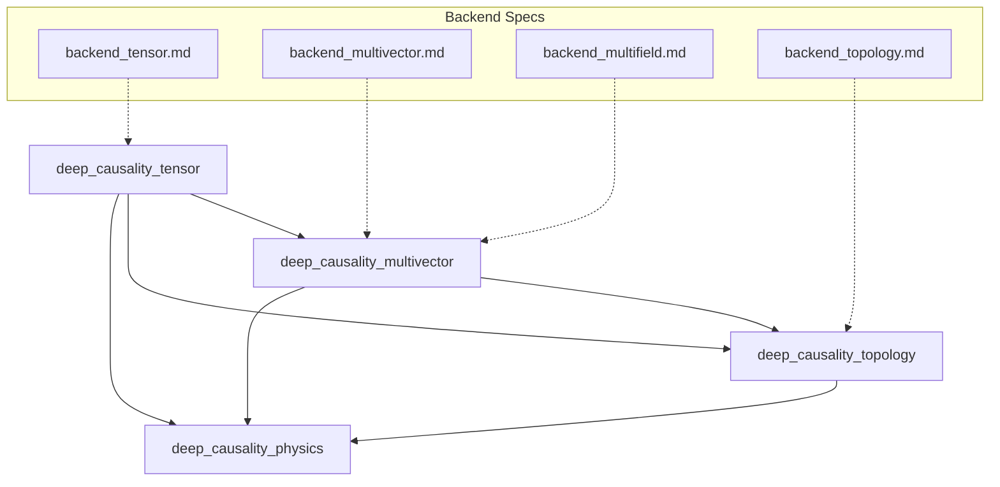

# Backend Architecture Implementation Plan

## Dependency Graph



---

## Implementation Order (Strict Sequence)

| Phase | Crate | Spec | Reason |
|-------|-------|------|--------|
| **1** | `deep_causality_tensor` | `backend_tensor.md` | Defines `TensorBackend`, `LinearAlgebraBackend`, `CpuBackend` — all other crates depend on this |
| **2** | `deep_causality_multivector` | `backend_multivector.md` | Uses tensor backend for `CausalMultiVector` acceleration |
| **3** | `deep_causality_multivector` | `backend_multifield.md` | `CausalMultiField<B, T>` requires Phase 2 complete |
| **4** | `deep_causality_topology` | `backend_topology.md` | Uses tensor backend + multivector for manifolds |
| **5** | `deep_causality_physics` | (No new spec) | Consumer — verify all physics code compiles |

---

## Phase 1: Tensor Backend

### Files to Create/Modify

| Action | File | Description |
|--------|------|-------------|
| CREATE | `src/backend/mod.rs` | `TensorBackend`, `LinearAlgebraBackend` traits |
| CREATE | `src/backend/cpu.rs` | `CpuBackend` wrapping existing `CausalTensor<T>` |
| CREATE | `src/backend/mlx.rs` | `MlxBackend` [feature-gated] |
| CREATE | `src/backend/aliases.rs` | `DefaultBackend`, `Tensor<T>` aliases |
| MODIFY | `src/lib.rs` | Export backend module |
| MODIFY | `Cargo.toml` | Add `parallel` feature with rayon |

### API Stability Analysis

| Current API | Change | Migration |
|-------------|--------|-----------|
| `CausalTensor<T>` | Becomes `CausalTensor<B, T>` | **Breaking** — type alias preserves compatibility |
| `CausalTensor::new()` | Unchanged signature | ✅ Stable |
| `CausalTensor::zeros()` | Unchanged signature | ✅ Stable |

**Compatibility Layer:**
```rust
// Preserve existing API via type alias
pub type CausalTensor<T> = crate::types::CausalTensor<CpuBackend, T>;
```

---

## Phase 2: Multivector Backend

### Files to Create/Modify

| Action | File | Description |
|--------|------|-------------|
| CREATE | `src/types/multivector/ops/geometric_product_accelerated.rs` | Backend-dispatched geometric product |
| CREATE | `src/traits/matrix_rep.rs` | `MatrixRep<B, T>` trait |
| CREATE | `src/types/multivector/gamma/mod.rs` | Gamma matrix loader per backend |
| MODIFY | `src/types/multivector/algebra/mod.rs` | Add dispatch logic |
| MODIFY | `Cargo.toml` | Forward `mlx` feature from tensor |

### API Stability Analysis

| Current API | Change | Migration |
|-------------|--------|-----------|
| `CausalMultiVector<T>` | Unchanged struct | ✅ Stable (backend dispatch is internal) |
| `geometric_product()` | Adds threshold-based backend dispatch | ✅ Stable (transparent) |
| `commutator()` | Adds threshold-based backend dispatch | ✅ Stable (transparent) |

---

## Phase 3: MultiField

### Files to Create/Modify

| Action | File | Description |
|--------|------|-------------|
| CREATE | `src/types/multifield/mod.rs` | `CausalMultiField<B, T>` struct |
| CREATE | `src/types/multifield/algebra.rs` | Ring, Module impls |
| CREATE | `src/types/multifield/products.rs` | geometric_product, cross, inner |
| CREATE | `src/types/multifield/differential.rs` | curl, divergence, gradient |
| CREATE | `src/types/multifield/grades.rs` | grade_project |
| CREATE | `src/types/multifield/conversions.rs` | from/to coefficients |
| MODIFY | `src/lib.rs` | Export `CausalMultiField` |

### API Stability Analysis

| Current API | Change | Migration |
|-------------|--------|-----------|
| N/A | New type | ✅ Additive only — no breaking changes |

---

## Phase 4: Topology Backend

### Files to Create/Modify

| Action | File | Description |
|--------|------|-------------|
| CREATE | `src/backend/mod.rs` | Re-export tensor backend |
| CREATE | `src/backend/topology_view.rs` | `TopologyView<B, T>` struct |
| CREATE | `src/backend/manifold_view.rs` | `ManifoldView<B, T>` struct |
| MODIFY | `src/types/graph/mod.rs` | Add `to_backend_view<B>()` method |
| MODIFY | `Cargo.toml` | Forward `mlx` feature |

### API Stability Analysis

| Current API | Change | Migration |
|-------------|--------|-----------|
| `CausalGraph` | Adds `to_backend_view()` method | ✅ Additive |
| `Manifold` | Adds `ManifoldView` projection | ✅ Additive |

---

## Phase 5: Physics Verification

### Verification Checklist

- [ ] `cargo build -p deep_causality_physics` — No compile errors
- [ ] `cargo test -p deep_causality_physics` — All existing tests pass
- [ ] MHD simulations (`mhd/`) work with default backend
- [ ] Electromagnetism (`electromagnetism/`) unchanged
- [ ] All physics examples compile

### Potential Impact Areas

| Module | Uses | Risk |
|--------|------|------|
| `mhd/` | `CausalTensor`, `CausalMultiVector` | Medium — verify type aliases work |
| `relativity/` | Manifold, Metric Tensor | Low — topology changes additive |
| `quantum/` | Spinors, Clifford | Low — multivector API stable |

---

## Feature Flag Propagation

```toml
# deep_causality_tensor/Cargo.toml
[features]
mlx = ["dep:mlx-rs"]
parallel = ["dep:rayon"]

# deep_causality_multivector/Cargo.toml
[features]
mlx = ["deep_causality_tensor/mlx"]

# deep_causality_topology/Cargo.toml
[features]
mlx = ["deep_causality_tensor/mlx"]

# deep_causality_physics/Cargo.toml
[features]
mlx = ["deep_causality_tensor/mlx", "deep_causality_multivector/mlx"]
```

---

## Testing Strategy Per Phase

| Phase | Tests |
|-------|-------|
| 1 | `CpuBackend` unit tests, existing tensor tests pass |
| 2 | `MatrixRep` roundtrip, geometric product parity |
| 3 | `CausalMultiField` algebraic laws, differential operators |
| 4 | `TopologyView` projection correctness |
| 5 | Full physics test suite regression |

---

## Summary: Critical Path

```
Phase 1 (Tensor) ──► Phase 2 (MultiVector) ──► Phase 3 (MultiField) ──► Phase 4 (Topology) ──► Phase 5 (Physics)
     │                      │                        │                       │
     └── CpuBackend         └── MatrixRep            └── CausalMultiField    └── TopologyView
         TensorBackend          Gamma Loader              Differential Ops       ManifoldView
         Aliases                Dispatch Logic            Conversions            Projection
```

**Estimated Effort:**
- Phase 1: 2-3 days
- Phase 2: 2 days
- Phase 3: 3-4 days
- Phase 4: 2 days
- Phase 5: 1 day (verification only)

**Total: ~10-12 days**
