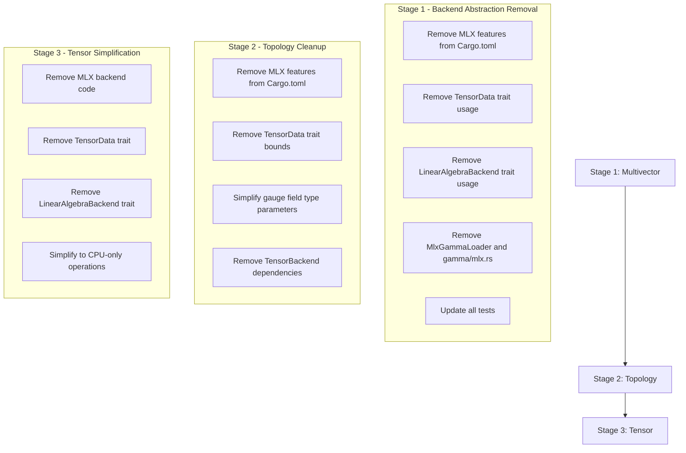

# MLX Backend Removal Specification

## Overview

This document specifies the complete removal of the MLX (Apple Metal) GPU acceleration backend from the DeepCausality
project. The removal follows a three-stage process aligned with the dependency chain, ensuring clean compilation at each
stage.

---

## Problem Statement

The MLX backend implementation has introduced significant architectural issues that impede the project's evolution:

1. **Leaky Abstraction**: The `TensorData` trait and `LinearAlgebraBackend` trait, originally designed for internal
   tensor operations, have leaked up through the topology crate to the application layer, introducing unnecessary trait
   bounds (`Send`, `Sync`, etc.) to higher-level gauge field implementations.

2. **Precision Mismatch**: MLX only supports `f32` floating-point precision, while the project's physics and topology
   applications require `f64` or `DoubleFloat` precision for numerical stability. Downcast from `f64` → `f32` causes
   unacceptable precision loss.

3. **HKT Complications**: The Higher-Kinded Type (HKT) implementation from `deep_causality_haft` has been unnecessarily
   complicated by `TensorData` trait bounds propagating through type parameters.

4. **Platform Lock-in**: MLX is only available on macOS aarch64 (Apple Silicon), limiting cross-platform development and
   testing.

---

## Solution: Three-Stage Removal

> [!IMPORTANT]
> Each stage must compile and pass all tests before proceeding to the next stage. This ensures a reviewable, bisectable
> commit history.



---

## Stage 1: Multivector Crate - Full Backend Abstraction Removal

### Objective

Remove all MLX integration, `TensorData` trait dependencies, and `LinearAlgebraBackend` trait dependencies from the
multivector crate. After this stage, the multivector crate will have no dependency on tensor backend abstractions.

### Cargo.toml Changes

#### [MODIFY] [Cargo.toml](file:///Users/marvin/RustroverProjects/dcl/deep_causality/deep_causality_multivector/Cargo.toml)

**Remove** lines 27-34 (feature flags):

```toml
[features]
default = []
# MLX acceleration for Apple Silicon (M Series).
# Forwards to deep_causality_tensor/mlx for GPU-accelerated operations.
# Note: Only builds on macOS aarch64. f64 downcast to f32 for GPU execution.
mlx = ["deep_causality_tensor/mlx"]
# Future: CUDA support
cuda = ["deep_causality_tensor/cuda"]
```

**Replace with**:

```toml
[features]
default = []
```

---

### Source Files: TensorData Removal

The following files import and use `TensorData` from `deep_causality_tensor`. All occurrences must be removed or
replaced with direct trait bounds.

#### [MODIFY] [traits/matrix_rep.rs](file:///Users/marvin/RustroverProjects/dcl/deep_causality/deep_causality_multivector/src/traits/matrix_rep.rs)

**Current** (line 12, 41):

```rust
use deep_causality_tensor::{LinearAlgebraBackend, TensorData};
// ...
pub trait MatrixRep<B: LinearAlgebraBackend, T: TensorData> {
```

**Replace with**: Direct trait bounds or remove backend abstraction entirely:

```rust
use deep_causality_num::Field;
// ...
pub trait MatrixRep<T: Field + Copy + Default + PartialOrd> {
```

---

#### [MODIFY] [types/multivector/ops/ops_matrix_rep.rs](file:///Users/marvin/RustroverProjects/dcl/deep_causality/deep_causality_multivector/src/types/multivector/ops/ops_matrix_rep.rs)

**Current** (lines 14, 19):

```rust
use deep_causality_tensor::TensorData;
// ...
T: TensorData + Clone + Neg<Output = T>,
```

**Replace with**:

```rust
use deep_causality_num::Field;
// ...
T: Field + Copy + Default + PartialOrd + Clone + Neg<Output = T>,
```

---

#### [MODIFY] [types/multifield/algebra/mod.rs](file:///Users/marvin/RustroverProjects/dcl/deep_causality/deep_causality_multivector/src/types/multifield/algebra/mod.rs)

**Current** (lines 38, 47, 80, 169):

```rust
use deep_causality_tensor::{LinearAlgebraBackend, TensorData};
// Multiple occurrences of T: TensorData bounds
```

**Replace**: Remove `LinearAlgebraBackend` and `TensorData` imports. Replace bound with
`Field + Copy + Default + PartialOrd`.

---

#### [MODIFY] [types/multifield/arithmetic/mod.rs](file:///Users/marvin/RustroverProjects/dcl/deep_causality/deep_causality_multivector/src/types/multifield/arithmetic/mod.rs)

**Current** (line 14, and 10+ occurrences):

```rust
use deep_causality_tensor::{LinearAlgebraBackend, TensorData};
```

**Replace**: Remove imports, substitute `TensorData` bounds with explicit bounds.

---

#### [MODIFY] [types/multifield/ops/differential.rs](file:///Users/marvin/RustroverProjects/dcl/deep_causality/deep_causality_multivector/src/types/multifield/ops/differential.rs)

**Current** (lines 13, 32):

```rust
use deep_causality_tensor::{LinearAlgebraBackend, TensorData};
// ...
T: TensorData + Clone,
```

**Replace**: Remove imports, use direct bounds.

---

#### [MODIFY] [types/multifield/ops/batched_matmul.rs](file:///Users/marvin/RustroverProjects/dcl/deep_causality/deep_causality_multivector/src/types/multifield/ops/batched_matmul.rs)

**Current** (line 9):

```rust
use deep_causality_tensor::{CpuBackend, LinearAlgebraBackend, TensorBackend, TensorData};
```

**Replace**: This file will require significant refactoring as it uses backend-specific matmul operations. Consider:

- Implementing CPU-only matrix multiplication directly
- Using a simpler approach without backend abstraction

---

#### [MODIFY] [types/multifield/ops/products.rs](file:///Users/marvin/RustroverProjects/dcl/deep_causality/deep_causality_multivector/src/types/multifield/ops/products.rs)

**Current** (lines 18, 23):

```rust
use deep_causality_tensor::{LinearAlgebraBackend, TensorData};
```

**Replace**: Remove imports, use direct bounds.

---

#### [MODIFY] [types/multifield/ops/conversions.rs](file:///Users/marvin/RustroverProjects/dcl/deep_causality/deep_causality_multivector/src/types/multifield/ops/conversions.rs)

**Current** (lines 16, 21):

```rust
use deep_causality_tensor::{LinearAlgebraBackend, TensorData};
```

**Replace**: Remove imports, use direct bounds.

---

#### [MODIFY] [types/multifield/ops/grades.rs](file:///Users/marvin/RustroverProjects/dcl/deep_causality/deep_causality_multivector/src/types/multifield/ops/grades.rs)

**Current** (lines 12, 17):

```rust
use deep_causality_tensor::{LinearAlgebraBackend, TensorData};
```

**Replace**: Remove imports, use direct bounds.

---

### Gamma Module: Complete Removal of Backend Abstraction

#### [DELETE] [gamma/mlx.rs](file:///Users/marvin/RustroverProjects/dcl/deep_causality/deep_causality_multivector/src/types/multifield/gamma/mlx.rs)

MLX-specific gamma matrix loader implementation (~5KB). Delete entirely.

---

#### [MODIFY] [gamma/mod.rs](file:///Users/marvin/RustroverProjects/dcl/deep_causality/deep_causality_multivector/src/types/multifield/gamma/mod.rs)

**Current** (line 18):

```rust
use deep_causality_tensor::{TensorBackend, TensorData};
```

**Remove**: All imports from `deep_causality_tensor`. Remove `BackendGamma` trait if it relies on `TensorBackend`.
Simplify to CPU-only gamma computation.

---

#### [MODIFY] [gamma/provider.rs](file:///Users/marvin/RustroverProjects/dcl/deep_causality/deep_causality_multivector/src/types/multifield/gamma/provider.rs)

**Current** (line 9):

```rust
use deep_causality_tensor::{CpuBackend, LinearAlgebraBackend, TensorData};
```

**Remove**: Backend abstraction, simplify to direct CPU implementation.

---

#### [MODIFY] [gamma/cpu.rs](file:///Users/marvin/RustroverProjects/dcl/deep_causality/deep_causality_multivector/src/types/multifield/gamma/cpu.rs)

**Current** (line 12):

```rust
use deep_causality_tensor::{CpuBackend, TensorBackend, TensorData};
```

**Refactor**: Keep the gamma computation logic but remove backend abstraction. This becomes the only implementation.

---

### Test Files to Modify

#### [DELETE] [gamma/mlx_tests.rs](file:///Users/marvin/RustroverProjects/dcl/deep_causality/deep_causality_multivector/tests/types/multifield/gamma/mlx_tests.rs)

Complete MLX backend test file. Delete entirely.

---

#### [MODIFY] [gamma/mod.rs (tests)](file:///Users/marvin/RustroverProjects/dcl/deep_causality/deep_causality_multivector/tests/types/multifield/gamma/mod.rs)

**Remove** line 6:

```rust
mod mlx_tests;
```

---

#### [MODIFY] [gamma/providers_tests.rs](file:///Users/marvin/RustroverProjects/dcl/deep_causality/deep_causality_multivector/tests/types/multifield/gamma/providers_tests.rs)

**Remove** the entire `mlx_provider_tests` module (lines 62-82+):

```rust
// MlxBackend GammaProvider tests
#[cfg(all(feature = "mlx", target_os = "macos", target_arch = "aarch64"))]
mod mlx_provider_tests {
    ...
}
```

---

#### [MODIFY] [ops/batched_matmul_tests.rs](file:///Users/marvin/RustroverProjects/dcl/deep_causality/deep_causality_multivector/tests/types/multifield/ops/batched_matmul_tests.rs)

**Remove** the entire `mlx_batched_matmul_tests` module (lines 158-201+):

```rust
// MlxBackend BatchedMatMul tests
#[cfg(all(feature = "mlx", target_os = "macos", target_arch = "aarch64"))]
mod mlx_batched_matmul_tests {
    ...
}
```

---

### Summary of TensorData Removal Locations

| File                                      | TensorData Occurrences | LinearAlgebraBackend | Action                                             |
|-------------------------------------------|------------------------|----------------------|----------------------------------------------------|
| `traits/matrix_rep.rs`                    | 1                      | 1                    | Replace with `Field + Copy + Default + PartialOrd` |
| `types/multivector/ops/ops_matrix_rep.rs` | 1                      | 0                    | Replace bounds                                     |
| `types/multifield/algebra/mod.rs`         | 4                      | 1                    | Replace bounds                                     |
| `types/multifield/arithmetic/mod.rs`      | 9                      | 1                    | Replace bounds                                     |
| `types/multifield/ops/differential.rs`    | 1                      | 1                    | Replace bounds                                     |
| `types/multifield/ops/batched_matmul.rs`  | 4                      | 1                    | Major refactor                                     |
| `types/multifield/ops/products.rs`        | 1                      | 1                    | Replace bounds                                     |
| `types/multifield/ops/conversions.rs`     | 1                      | 1                    | Replace bounds                                     |
| `types/multifield/ops/grades.rs`          | 1                      | 1                    | Replace bounds                                     |
| `types/multifield/gamma/*.rs`             | 6                      | 2                    | Replace/refactor                                   |

---

### Verification

```bash
cd deep_causality_multivector

# Check compilation
cargo check

# Run all tests
cargo test

# Verify no TensorData/LinearAlgebraBackend/MLX references remain
grep -r "TensorData\|LinearAlgebraBackend\|MlxBackend\|mlx" src/ tests/ --include="*.rs"

# Verify examples still run
cargo run --example basic_multivector_example
```

---

## Stage 2: Topology Crate - TensorData/Backend Removal

### Objective

Remove MLX integration and all `TensorData` / `TensorBackend` / `LinearAlgebraBackend` trait dependencies from the
topology crate. Simplify gauge field implementations to use direct trait bounds.

### Cargo.toml Changes

#### [MODIFY] [Cargo.toml](file:///Users/marvin/RustroverProjects/dcl/deep_causality/deep_causality_topology/Cargo.toml)

**Remove** lines 25-35:

```toml
# MLX acceleration for Apple Silicon (M Series).
# Forwards to deep_causality_tensor/mlx and deep_causality_multivector/mlx
# for MLX / GPU-accelerated operations.
# Note: Only builds on macOS aarch64. f64 downcast to f32 for GPU execution.
mlx = ["dep:mlx-rs", "deep_causality_tensor/mlx", "deep_causality_multivector/mlx"]
# Future: CUDA support
cuda = ["deep_causality_tensor/cuda"]

# MLX dependency - only available on macOS aarch64
[target.'cfg(all(target_os = "macos", target_arch = "aarch64"))'.dependencies]
mlx-rs = { version = "0.25.3", features = ["metal"], optional = true }
```

---

### Source Files: TensorData Removal

#### [MODIFY] [hkt_gauge_witness.rs](file:///Users/marvin/RustroverProjects/dcl/deep_causality/deep_causality_topology/src/extensions/hkt_gauge/hkt_gauge_witness.rs)

**Current** (line 9):
```rust
use deep_causality_tensor::{CausalTensor, TensorData};
```

**Replace** import with `use deep_causality_num::Field;` and all `T: TensorData` bounds with `T: Field + Copy + Default + PartialOrd`.

---

#### [MODIFY] [hkt_curvature.rs](file:///Users/marvin/RustroverProjects/dcl/deep_causality/deep_causality_topology/src/extensions/hkt_gauge/hkt_curvature.rs)

**Current** (line 49):
```rust
use deep_causality_tensor::TensorData;
```

**Replace** with `use deep_causality_num::Field;`. Replace `T: TensorData + Field + Float` with `T: Field + Float + Copy + Default + PartialOrd`.

---

#### [MODIFY] [hkt_lattice_gauge.rs](file:///Users/marvin/RustroverProjects/dcl/deep_causality/deep_causality_topology/src/extensions/hkt_gauge/hkt_lattice_gauge.rs)

**Current** (line 30):
```rust
use deep_causality_tensor::TensorData;
```

**Remove** import. Replace all 12+ occurrences of `M: TensorData` with `M: Field + Copy + Default + PartialOrd`.

---

#### [MODIFY] [ops_actions.rs](file:///Users/marvin/RustroverProjects/dcl/deep_causality/deep_causality_topology/src/types/gauge/gauge_field_lattice/ops_actions.rs)

**Current** (line 13): `use deep_causality_tensor::TensorData;`

**Remove** import. Replace `M: TensorData + Debug + ComplexField<R>` with `M: Field + Copy + Default + PartialOrd + Debug + ComplexField<R>`.

---

#### [MODIFY] [ops_metropolis.rs](file:///Users/marvin/RustroverProjects/dcl/deep_causality/deep_causality_topology/src/types/gauge/gauge_field_lattice/ops_metropolis.rs)

**Current** (line 16): `use deep_causality_tensor::TensorData;`

**Remove** import. Replace bounds with `Field + Copy + Default + PartialOrd`.

---

#### [MODIFY] [ops_monte_carlo.rs](file:///Users/marvin/RustroverProjects/dcl/deep_causality/deep_causality_topology/src/types/gauge/gauge_field_lattice/ops_monte_carlo.rs)

**Current** (line 15): `use deep_causality_tensor::TensorData;`

**Remove** import. Replace bounds with `Field + Copy + Default + PartialOrd`.

---

#### [MODIFY] [ops_gradient_flow.rs](file:///Users/marvin/RustroverProjects/dcl/deep_causality/deep_causality_topology/src/types/gauge/gauge_field_lattice/ops_gradient_flow.rs)

**Current** (line 15): `use deep_causality_tensor::TensorData;`

**Remove** import. Replace bounds with `Field + Copy + Default + PartialOrd`.

---

#### [MODIFY] [ops_wilson.rs](file:///Users/marvin/RustroverProjects/dcl/deep_causality/deep_causality_topology/src/types/gauge/gauge_field_lattice/ops_wilson.rs)

**Current** (line 14): `use deep_causality_tensor::TensorData;`

**Remove** import. Replace bounds with `Field + Copy + Default + PartialOrd`.

---

#### [MODIFY] [ops_plague.rs](file:///Users/marvin/RustroverProjects/dcl/deep_causality/deep_causality_topology/src/types/gauge/gauge_field_lattice/ops_plague.rs)

**Current** (line 15): `use deep_causality_tensor::TensorData;`

**Remove** import. Replace bounds with `Field + Copy + Default + PartialOrd`.

---

#### [MODIFY] [ops_smearing.rs](file:///Users/marvin/RustroverProjects/dcl/deep_causality/deep_causality_topology/src/types/gauge/gauge_field_lattice/ops_smearing.rs)

**Current** (line 15): `use deep_causality_tensor::TensorData;`

**Remove** import. Replace bounds with `Field + Copy + Default + PartialOrd`.

---

#### [MODIFY] [utils.rs](file:///Users/marvin/RustroverProjects/dcl/deep_causality/deep_causality_topology/src/types/gauge/gauge_field_lattice/utils.rs)

**Current** (line 7): `use deep_causality_tensor::TensorData;`

**Remove** import. Replace bounds with `Field + Copy + Default + PartialOrd`.

---

#### [MODIFY] [gauge_field_lattice/mod.rs](file:///Users/marvin/RustroverProjects/dcl/deep_causality/deep_causality_topology/src/types/gauge/gauge_field_lattice/mod.rs)

**Current** (line 42): `use deep_causality_tensor::TensorData;`

**Remove** import. Replace bounds with `Field + Copy + Default + PartialOrd`.

---

#### [MODIFY] [link_variable/mod.rs](file:///Users/marvin/RustroverProjects/dcl/deep_causality/deep_causality_topology/src/types/gauge/link_variable/mod.rs)

**Current** (line 17): `use deep_causality_tensor::{CausalTensor, TensorData};`

**Replace** with `use deep_causality_num::Field;`. Replace `M: TensorData` with `M: Field + Copy + Default + PartialOrd`.

---

#### [MODIFY] [link_variable/ops.rs](file:///Users/marvin/RustroverProjects/dcl/deep_causality/deep_causality_topology/src/types/gauge/link_variable/ops.rs)

**Current** (line 8): `use deep_causality_tensor::{CausalTensor, TensorData};`

**Replace** with `use deep_causality_num::Field;`. Replace bounds with `Field + Copy + Default + PartialOrd`.

---

#### [MODIFY] [topology_view.rs](file:///Users/marvin/RustroverProjects/dcl/deep_causality/deep_causality_topology/src/types/backend/topology_view.rs)

**Current** (line 11): `use deep_causality_tensor::TensorData;`

**Remove** import. Replace `T: TensorData` bounds with `T: Field + Copy + Default + PartialOrd`.

---

### TensorData Removal Summary

| File | Occurrences | Replacement |
|------|-------------|-------------|
| `hkt_gauge_witness.rs` | 8 | `Field + Copy + Default + PartialOrd` |
| `hkt_curvature.rs` | 2 | `Field + Float + Copy + Default + PartialOrd` |
| `hkt_lattice_gauge.rs` | 12+ | `Field + Copy + Default + PartialOrd` |
| `ops_actions.rs` | 1 | `Field + Copy + Default + PartialOrd` |
| `ops_metropolis.rs` | 1 | `Field + Copy + Default + PartialOrd` |
| `ops_monte_carlo.rs` | 1 | `Field + Copy + Default + PartialOrd` |
| `ops_gradient_flow.rs` | 1 | `Field + Copy + Default + PartialOrd` |
| `ops_wilson.rs` | 1 | `Field + Copy + Default + PartialOrd` |
| `ops_plague.rs` | 1 | `Field + Copy + Default + PartialOrd` |
| `ops_smearing.rs` | 1 | `Field + Copy + Default + PartialOrd` |
| `utils.rs` | 1 | `Field + Copy + Default + PartialOrd` |
| `gauge_field_lattice/mod.rs` | 1 | `Field + Copy + Default + PartialOrd` |
| `link_variable/mod.rs` | 1 | `Field + Copy + Default + PartialOrd` |
| `link_variable/ops.rs` | 1 | `Field + Copy + Default + PartialOrd` |
| `topology_view.rs` | 3 | `Field + Copy + Default + PartialOrd` |

---

### Replacement Strategy

For all `TensorData` bounds, replace with:

```rust
// Before
T: TensorData + Debug + ComplexField<R> + DivisionAlgebra<R>

// After
T: Field + Copy + Default + PartialOrd + Debug + ComplexField<R> + DivisionAlgebra<R>
```

Or use a simpler type alias:

```rust
// In a central location
pub trait TopologyElement: Field + Copy + Default + PartialOrd {}
impl<T: Field + Copy + Default + PartialOrd> TopologyElement for T {}
```

---

### Verification

```bash
cd deep_causality_topology

cargo check
cargo test

# Verify no TensorData/backend references remain
grep -r "TensorData\|TensorBackend\|LinearAlgebraBackend\|mlx" src/ tests/ --include="*.rs"

cargo run --example basic_graph
cargo run --example lattice_gauge_simulation
```

---

## Stage 3: Tensor Crate - Complete Simplification

### Objective

Remove the MLX backend entirely, delete `TensorData` trait, delete `LinearAlgebraBackend` trait, and simplify to
CPU-only tensor operations.

### Files to Delete

#### [DELETE] [src/types/backend/mlx/](file:///Users/marvin/RustroverProjects/dcl/deep_causality/deep_causality_tensor/src/types/backend/mlx)

Entire directory (~40KB):

- `mod.rs` (1.8KB)
- `mlx_backend_tensor.rs` (22.6KB)
- `mlx_backend_linear_algebra.rs` (9.3KB)
- `mlx_tensor_impl.rs` (7.5KB)

---

#### [DELETE] [src/types/mlx_tensor/](file:///Users/marvin/RustroverProjects/dcl/deep_causality/deep_causality_tensor/src/types/mlx_tensor)

Entire directory containing `MlxTensor<T>` wrapper.

---

#### [DELETE] [src/traits/tensor_data.rs](file:///Users/marvin/RustroverProjects/dcl/deep_causality/deep_causality_tensor/src/traits/tensor_data.rs)

The `TensorData` trait is no longer needed after Stage 1 and 2 remove all usages.

---

#### [DELETE] [src/traits/backend_linear_algebra.rs](file:///Users/marvin/RustroverProjects/dcl/deep_causality/deep_causality_tensor/src/traits/backend_linear_algebra.rs)

The `LinearAlgebraBackend` trait is no longer needed.

---

### Cargo.toml Changes

#### [MODIFY] [Cargo.toml](file:///Users/marvin/RustroverProjects/dcl/deep_causality/deep_causality_tensor/Cargo.toml)

**Remove** lines 27-38:

```toml
[features]
default = []
cuda = []
mlx = ["dep:mlx-rs"]

[target.'cfg(all(target_os = "macos", target_arch = "aarch64"))'.dependencies]
mlx-rs = { version = "0.25.3", features = ["metal"], optional = true }
```

**Replace with**:

```toml
[features]
default = []
```

---

### lib.rs Changes

#### [MODIFY] [src/lib.rs](file:///Users/marvin/RustroverProjects/dcl/deep_causality/deep_causality_tensor/src/lib.rs)

**Remove**:

```rust
// Remove MLX exports
#[cfg(all(feature = "mlx", target_os = "macos", target_arch = "aarch64"))]
pub use crate::types::backend::mlx::{MlxBackend, MlxCausalTensor};

// Remove TensorData export
pub use crate::traits::tensor_data::TensorData;

// Remove LinearAlgebraBackend export
pub use crate::traits::backend_linear_algebra::LinearAlgebraBackend;

// Remove conditional type aliases
#[cfg(feature = "mlx")]
pub type DefaultBackend = CpuBackend;
// etc.
```

**Simplify to**:

```rust
/// Default backend for CausalTensor (CPU-only).
pub type DefaultBackend = CpuBackend;

/// Default floating-point precision (f64 for full physics verification).
pub type DefaultFloat = f64;
```

---

### Error Type Cleanup

#### [MODIFY] [src/errors/causal_tensor_error.rs](file:///Users/marvin/RustroverProjects/dcl/deep_causality/deep_causality_tensor/src/errors/causal_tensor_error.rs)

**Remove** all MLX-related error variants:

```rust
#[cfg(all(feature = "mlx", ...))]
MlxConversionFailed,
MlxEvalFailed,
MlxOperationFailed(String),
```

---

### Verification

```bash
cd deep_causality_tensor

cargo check
cargo test

# Verify no MLX/TensorData/LinearAlgebraBackend references remain
grep -r "mlx\|TensorData\|LinearAlgebraBackend" src/ --include="*.rs"

cargo run --example causal_tensor
```

---

## Full Workspace Verification

After all three stages are complete:

```bash
cd /Users/marvin/RustroverProjects/dcl/deep_causality

# Check all crates
cargo check -p deep_causality_tensor
cargo check -p deep_causality_multivector
cargo check -p deep_causality_topology
cargo check --workspace

# Run all tests
cargo test --workspace

# Verify no MLX/TensorData/LinearAlgebraBackend references remain
grep -r "mlx\|TensorData\|LinearAlgebraBackend" \
    deep_causality_tensor/src \
    deep_causality_multivector/src \
    deep_causality_topology/src \
    --include="*.rs" --include="*.toml"
```

---

## Example Code Assessment

All examples should continue to work after the refactoring. The key change is that backend abstraction is removed -
everything uses CPU-based computation directly.

| Crate                        | Examples   | Impact                                          |
|------------------------------|------------|-------------------------------------------------|
| `deep_causality_multivector` | 8 examples | Remove any `CpuBackend`/`MlxBackend` references |
| `deep_causality_tensor`      | 5 examples | Should work unchanged                           |
| `deep_causality_topology`    | 7 examples | Remove any backend type parameters              |
