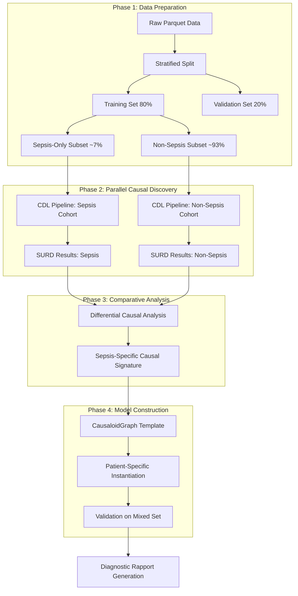

# ICU Sepsis Causal Discovery: CDL Pipeline Specification

This document specifies the transformation of the ICU Sepsis case study into a streamlined, reproducible causal discovery process using the Causal Discovery Language (CDL).

## 1. Problem Statement

### 1.1 Clinical Context

Sepsis is a life-threatening pathology caused by a dysregulated host response to infection. Early detection in the ICU is critical—every hour of delayed treatment increases mortality by 7.6%. The PhysioNet Computing in Cardiology Challenge 2019 demonstrated that even the best ML models could only detect ~36% of sepsis cases, highlighting the limitations of purely statistical approaches.

### 1.2 Dataset Characteristics

| Property | Value |
|----------|-------|
| Total Patients | 40,336 |
| Total Records | 1,552,210 |
| Average Records/Patient | ~38 (hourly time series) |
| Clinical Variables | 40 per time window |
| Target | `SepsisLabel` (binary) |

### 1.3 Key Challenges

> [!CAUTION]
> **Challenge 1: Severe Class Imbalance**
> 
> Approximately 93% of records are non-sepsis cases. Only ~7% of patients ever develop sepsis. This imbalance causes standard ML algorithms to optimize for predicting "not sepsis" rather than detecting true sepsis onset.

> [!WARNING]
> **Challenge 2: Temporal Progression (Mini Time-Series)**
> 
> Each patient has a unique temporal trajectory of ~38 hourly observations. Sepsis onset is a *process*, not a static state. Causal mechanisms may differ between:
> - Early ICU admission (hours 0-12)
> - Mid-stay (hours 12-48)
> - Late-onset (hours 48+)

> [!IMPORTANT]
> **Challenge 3: Confounding Variables ("Red Herrings")**
> 
> Several administrative/demographic features exhibit spurious correlations:
> 
> | Feature | Correlation Issue |
> |---------|-------------------|
> | `Unit2` (SICU) | High correlation with sepsis, but patients are *placed* there *because* they're severe—selection bias, not causation |
> | `ICULOS` | Longer stays correlate with sepsis, but this is a *consequence*, not a cause |
> | `HospAdmTime` | Confounded by illness severity at admission |
> | `Patient_ID` | Spurious correlation due to denormalized time-series structure |

---

## 2. CDL Pipeline Design

> [!TIP]
> **Parallelization**: The SURD algorithm supports parallel execution via the `--features parallel` cargo feature flag in `deep_causality_algorithms`. No additional parallel infrastructure is needed—simply enable the feature flag for significant speedup on multi-core systems.

### 2.1 High-Level Architecture



### 2.2 CDL Pipeline Definition

The CDL pipeline will be defined as a clean, composable monadic chain:

```rust
use deep_causality_discovery::*;

// Confound column indices to exclude
const PATIENT_ID: usize = 42;
const ICULOS: usize = 40;
const UNIT1: usize = 37;
const UNIT2: usize = 38;
const HOSP_ADM_TIME: usize = 39;
const TARGET_INDEX: usize = 41;  // SepsisLabel

/// Main CDL pipeline for sepsis causal discovery
fn run_sepsis_discovery(data_path: &str) -> CdlEffect<CdlReport> {
    // Exclude confounding variables
    let exclude_indices = vec![PATIENT_ID, ICULOS, UNIT1, UNIT2, HOSP_ADM_TIME];
    
    CdlBuilder::build()
        // Step 1: Load data with confound exclusion
        .bind(|cdl| cdl.load_data(data_path, TARGET_INDEX, exclude_indices.clone()))
        
        // Step 2: Clean data (converts NaN to Option::None)
        .bind(|cdl| cdl.clean_data(OptionNoneDataCleaner))
        
        // Step 3: Feature selection using MRMR
        .bind(|cdl| cdl.feature_select(|tensor| {
            // Select top 20 features, target adjusted for excluded columns
            mrmr_features_selector(tensor, 20, TARGET_INDEX)
        }))
        
        // Step 4: Causal discovery using SURD
        // MaxOrder::Max explores all interaction orders since causal structure is unknown
        .bind(|cdl| cdl.causal_discovery(|tensor| {
            surd_states_cdl(tensor, MaxOrder::Max).map_err(Into::into)
        }))
        
        // Step 5: Analyze results (uses default or config thresholds)
        .bind(|cdl| cdl.analyze())
        
        // Step 6: Generate report
        .bind(|cdl| cdl.finalize())
}
```

> [!NOTE]
> **Configuration**: To customize analysis thresholds, use `CdlConfig::new().with_analysis(AnalyzeConfig::new(synergy, unique, redundancy))` when building the pipeline. For this study, we recommend thresholds of `AnalyzeConfig::new(0.10, 0.15, 0.05)`.


---

## 3. Implementation Phases

### Phase 1: Data Preparation Pipeline

#### 3.1.1 Stratified Data Splitting

```rust
/// Configuration for stratified train/validation split
pub struct StratifiedSplitConfig {
    /// Training set proportion (default: 0.80)
    train_ratio: f64,
    /// Target column for stratification
    stratify_column: String,
    /// Random seed for reproducibility
    seed: u64,
}

impl CDL<NoData> {
    /// Split data maintaining class proportions
    pub fn stratified_split(
        self,
        config: StratifiedSplitConfig,
    ) -> CdlEffect<(CDL<WithData>, CDL<WithData>)>;
}
```

#### 3.1.2 Cohort Separation

```rust
/// Cohort enumeration for parallel analysis
#[derive(Clone, Copy)]
pub enum Cohort {
    /// All patients (baseline)
    All,
    /// Patients who developed sepsis (SepsisLabel = 1 at any point)
    SepsisPositive,
    /// Patients who never developed sepsis
    SepsisNegative,
}

impl CDL<WithData> {
    /// Filter data to specific cohort
    pub fn filter_cohort(self, cohort: Cohort) -> CdlEffect<CDL<WithData>>;
}
```

#### 3.1.3 Confound Exclusion

The following fields MUST be excluded from causal analysis to prevent spurious correlations:

| Field | Reason for Exclusion |
|-------|---------------------|
| `Patient_ID` | Identifier, not a feature |
| `ICULOS` | Consequence of sepsis, not cause |
| `Unit1`, `Unit2` | Selection bias (patients placed in SICU *because* of severity) |
| `HospAdmTime` | Confounded by illness severity at admission |
| `Hour` | Time index, handled separately with temporal windowing |

---

### Phase 2: Dual-Cohort Causal Discovery

> [!NOTE]
> **Analysis Priority**: Dual-cohort analysis (sepsis vs. non-sepsis) is the **primary** approach. Temporal windowing (early vs. late ICU stay) is a **secondary** analysis to be conducted after initial results are validated.

#### 3.2.1 Dual-Cohort Analysis

The key insight is to run SURD on **both** sepsis and non-sepsis cohorts, then compare:

> [!IMPORTANT]
> **Proposed API Extension**: The `filter_cohort()` and `CdlBuilder::zip()` methods shown below are proposals for extending the CDL API. Until implemented, this workflow can be achieved by running two separate pipelines on pre-filtered datasets.

```rust
fn parallel_discovery(train_data: CDL<WithData>) -> CdlEffect<DualCohortResults> {
    // Parallel execution on both cohorts
    let sepsis_pipeline = train_data.clone()
        .filter_cohort(Cohort::SepsisPositive)
        .bind(run_feature_selection)
        .bind(run_surd_discovery);
    
    let non_sepsis_pipeline = train_data
        .filter_cohort(Cohort::SepsisNegative)
        .bind(run_feature_selection)
        .bind(run_surd_discovery);
    
    // Combine results
    CdlBuilder::zip(sepsis_pipeline, non_sepsis_pipeline)
        .bind(|(sepsis_result, non_sepsis_result)| {
            DualCohortResults::new(sepsis_result, non_sepsis_result)
        })
}
```

#### 3.2.2 SURD Configuration for Clinical Discovery

```rust
/// SURD configuration optimized for clinical time-series
pub struct ClinicalSurdConfig {
    /// Maximum interaction order (Max to explore full causal structure)
    max_order: MaxOrder,
    /// Minimum sample size per state (prevents overfitting)
    min_state_samples: usize,
    /// Bootstrap iterations for confidence intervals
    bootstrap_iterations: usize,
}

impl Default for ClinicalSurdConfig {
    fn default() -> Self {
        Self {
            // MaxOrder::Max since causal structure is unknown
            max_order: MaxOrder::Max,
            min_state_samples: 30,
            bootstrap_iterations: 100,
        }
    }
}
```

---

### Phase 3: Differential Causal Analysis

#### 3.3.1 Comparative SURD Interpretation

```rust
/// Results of comparing SURD outputs between cohorts
pub struct DifferentialCausalSignature {
    /// Features with HIGH Unique influence in sepsis, LOW in non-sepsis
    sepsis_specific_drivers: Vec<CausalDriver>,
    
    /// Features with HIGH Synergistic influence in sepsis
    sepsis_synergies: Vec<(Feature, Feature, f64)>,
    
    /// Features with HIGH Redundancy in BOTH cohorts (general ICU sickness)
    shared_illness_markers: Vec<Feature>,
    
    /// Confounds detected (high in non-sepsis, misleading in combined)
    detected_confounds: Vec<ConfoundReport>,
}

impl DualCohortResults {
    /// Compute differential causal signature
    pub fn differential_analysis(&self) -> DifferentialCausalSignature {
        // Compare Unique components
        let sepsis_unique = self.sepsis.unique_contributions();
        let non_sepsis_unique = self.non_sepsis.unique_contributions();
        
        // Features with unique influence ONLY in sepsis cohort
        let sepsis_specific = sepsis_unique
            .iter()
            .filter(|(feat, score)| {
                *score > 0.10 && non_sepsis_unique.get(feat).unwrap_or(&0.0) < 0.05
            })
            .collect();
        
        // ... similar for synergies and redundancies
    }
}
```

#### 3.3.2 Expected Findings (Hypothesis)

Based on preliminary MRMR analysis, we expect SURD to reveal:

| Component | Sepsis Cohort | Non-Sepsis Cohort | Interpretation |
|-----------|---------------|-------------------|----------------|
| **Unique: Lactate** | High (~0.15) | Low (~0.02) | Sepsis-specific biomarker |
| **Unique: WBC** | Moderate (~0.08) | Low (~0.03) | Inflammatory response |
| **Unique: HR + Resp** | Low individually | Low | - |
| **Synergy: HR × Resp** | High (~0.12) | Low (~0.02) | Joint early warning signal |
| **Redundant: Age, Gender** | Moderate | Moderate | General risk factors |
| **Redundant: Unit2** | High | High | CONFOUND - exclude |

---

### Phase 4: Model Construction

#### 3.4.1 CausaloidGraph Template

The differential causal signature translates directly into a `CausaloidGraph`:

```rust
/// Build CausaloidGraph from causal signature
fn build_sepsis_causaloid_graph(
    signature: &DifferentialCausalSignature,
) -> CausaloidGraph {
    let mut graph = CausaloidGraph::new();
    
    // 1. Add unique drivers as direct edges
    for driver in &signature.sepsis_specific_drivers {
        graph.add_causaloid(
            Causaloid::new(driver.feature.clone())
                .with_causal_fn(|ctx: &PatientContext| {
                    // Evaluate feature trend over relative time window
                    let values = ctx.get_relative_window(driver.feature, -6, 0);
                    driver.evaluate_trend(values)
                })
                .with_weight(driver.unique_score)
        );
    }
    
    // 2. Add synergistic pairs as AND-gates
    for (feat_a, feat_b, score) in &signature.sepsis_synergies {
        graph.add_causaloid_collection(
            CausaloidCollection::new(vec![feat_a.clone(), feat_b.clone()])
                .with_logic(AggregateLogic::All) // AND
                .with_weight(*score)
        );
    }
    
    graph
}
```

#### 3.4.2 Patient-Specific Instantiation with Relative Indexing

```rust
/// Patient context with relative temporal indexing
pub struct PatientContext {
    patient_id: u64,
    /// All observations indexed relative to current evaluation point
    observations: BTreeMap<i32, PatientObservation>,
    /// Current evaluation hour (relative to ICU admission)
    current_hour: i32,
}

impl PatientContext {
    /// Get feature values over a relative time window
    /// - `start_offset`: hours before current (negative)
    /// - `end_offset`: hours after current (usually 0)
    pub fn get_relative_window(
        &self,
        feature: &str,
        start_offset: i32,
        end_offset: i32,
    ) -> Vec<MaybeUncertain<f64>> {
        (start_offset..=end_offset)
            .map(|offset| {
                let hour = self.current_hour + offset;
                self.observations
                    .get(&hour)
                    .and_then(|obs| obs.get_feature(feature))
                    .map(MaybeUncertain::Known)
                    .unwrap_or(MaybeUncertain::Unknown)
            })
            .collect()
    }
}
```

---

## 4. Validation Protocol

### 4.1 Metrics

> [!IMPORTANT]
> **Validation Focus**: Always prioritize **sensitivity** (catching true sepsis cases) over precision. In a clinical ICU setting, missing a true sepsis case is far more harmful than a false alarm.

| Metric | Target | Rationale |
|--------|--------|-----------|
| **Sensitivity (Recall)** | > 0.50 | **Primary metric** - prioritize catching true sepsis cases |
| **Precision** | > 0.30 | Secondary - acceptable false alarm rate for ICU |
| **PhysioNet Utility Score** | > 0.40 | Clinical utility benchmark |
| **Explainability** | 100% | All predictions must have causal justification |

### 4.2 Validation Pipeline

```rust
fn validate_model(
    graph: &CausaloidGraph,
    validation_data: CDL<WithData>,
) -> CdlEffect<ValidationReport> {
    validation_data
        .for_each_patient(|patient_data| {
            // Build patient-specific context
            let context = PatientContext::from_timeseries(patient_data);
            
            // Evaluate at each hour
            let predictions = context.hours().map(|hour| {
                let ctx = context.at_hour(hour);
                let prediction = graph.evaluate(&ctx);
                
                (hour, prediction, patient_data.sepsis_label_at(hour))
            });
            
            ValidationResult::from_predictions(predictions)
        })
        .aggregate_metrics()
}
```

---

## 5. Diagnostic Rapport Output

### 5.1 Per-Patient Report Structure

```
╔═══════════════════════════════════════════════════════════════╗
║                    SEPSIS RISK ASSESSMENT                      ║
╠═══════════════════════════════════════════════════════════════╣
║ Patient ID: 42                                                 ║
║ Evaluation Time: Hour 18 (ICU Day 0, 18:00)                   ║
╠═══════════════════════════════════════════════════════════════╣
║ RISK LEVEL: ██████████░░░ HIGH (78%)                          ║
║ Confidence: 85% (based on 14/16 required measurements)        ║
╠═══════════════════════════════════════════════════════════════╣
║ PRIMARY CAUSAL DRIVERS:                                        ║
║                                                                 ║
║  1. Lactate Trend [UNIQUE]                           ████ 42%  ║
║     └─ Rising pattern: 1.8 → 2.4 → 3.1 mmol/L (last 6h)       ║
║                                                                 ║
║  2. HR × Resp Synergy [SYNERGISTIC]                  ███░ 28%  ║
║     └─ HR: 112 bpm (↑15%), Resp: 24/min (↑20%)                ║
║                                                                 ║
║  3. WBC Elevation [UNIQUE]                           ██░░ 18%  ║
║     └─ 14.2 × 10⁹/L (elevated above 12.0)                     ║
║                                                                 ║
║  4. Temperature Pattern [SUPPORTING]                  █░░░ 12%  ║
║     └─ 38.4°C (febrile)                                        ║
╠═══════════════════════════════════════════════════════════════╣
║ DATA QUALITY FLAGS:                                            ║
║  ⚠ Fibrinogen: MISSING (imputed from trend)                   ║
║  ⚠ EtCO2: MISSING (not available)                             ║
║  ✓ All vital signs: PRESENT                                    ║
╠═══════════════════════════════════════════════════════════════╣
║ RECOMMENDED ACTIONS:                                           ║
║  • Initiate sepsis bundle protocol                             ║
║  • Order blood cultures                                        ║
║  • Consider broad-spectrum antibiotics                         ║
╚═══════════════════════════════════════════════════════════════╝
```

### 5.2 Report Data Structure

```rust
/// Diagnostic rapport for clinical decision support
#[derive(Debug)]
pub struct DiagnosticRapport {
    pub patient_id: u64,
    pub evaluation_hour: i32,
    
    /// Risk assessment
    pub risk_level: RiskLevel,
    pub risk_probability: f64,
    pub confidence: f64,
    
    /// Causal explanation
    pub causal_drivers: Vec<CausalDriver>,
    
    /// Data quality
    pub data_quality: DataQualityReport,
    
    /// Clinical recommendations
    pub recommendations: Vec<ClinicalRecommendation>,
}

impl Display for DiagnosticRapport {
    // Formatted output as shown above
}
```

---

## 6. Implementation Roadmap

### 6.1 Task Breakdown

| Phase | Task | Priority | Complexity |
|-------|------|----------|------------|
| **1** | Implement `StratifiedSplitConfig` and `stratified_split()` | High | Medium |
| **1** | Implement `Cohort` enum and `filter_cohort()` | High | Low |
| **1** | Add confound exclusion to `DataLoaderConfig` | High | Low |
| **2** | Implement `ClinicalSurdConfig` | Medium | Low |
| **2** | Add `CdlBuilder::zip()` for parallel pipelines | Medium | Medium |
| **3** | Implement `DifferentialCausalSignature` | High | High |
| **3** | Implement comparative SURD analysis | High | High |
| **4** | Implement `PatientContext` with relative indexing | High | Medium |
| **4** | Implement `CausaloidGraph` template builder | High | High |
| **4** | Implement validation pipeline | High | Medium |
| **5** | Implement `DiagnosticRapport` formatter | Medium | Low |

### 6.2 Dependencies


---

## 7. Success Criteria

1. **Reproducibility**: Running the same CDL pipeline produces identical results
2. **Interpretability**: Every prediction has a complete causal trace
3. **Clinical Utility**: PhysioNet Utility Score > 0.40
4. **Performance**: Full pipeline execution < 5 minutes on standard hardware
5. **Code Quality**: All new code has > 80% test coverage

---

## 8. References

- [PhysioNet Computing in Cardiology Challenge 2019](https://physionet.org/content/challenge-2019/)
- [SURD Algorithm Paper](https://arxiv.org/abs/xxxx) 
- [deep_causality_discovery README](../../../deep_causality_discovery/README.md)
- [Experiment Draft Notes](../../examples/case_study_icu_sepsis/notes/experiment_draft.md)
- [Stage Two Findings](../../examples/case_study_icu_sepsis/notes/stage_two_findings.md)
