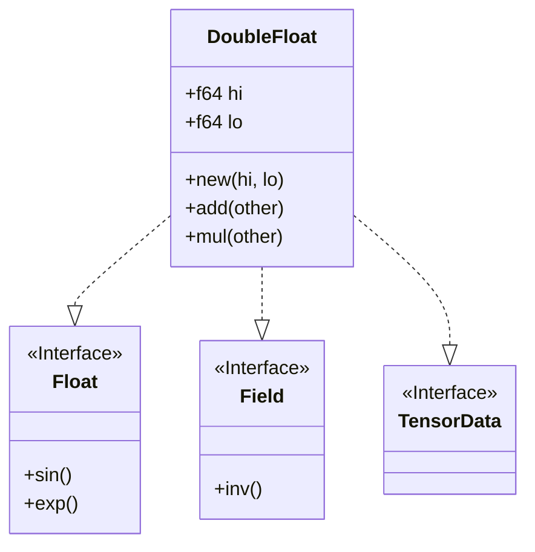

# DoubleFloat: High-Precision Double-Double Arithmetic Infrastructure

* **Product Area:** Deep Causality
* **Crate:** `deep_causality_num`
* **Status:** Draft
* **Target:** Q1 2026
* **Classification:** Core Infrastructure
* **Owner:** DeepCausality Authors

---

## 1. Executive Summary

This document specifies the **Double-Double (DoubleFloat)** arithmetic infrastructure. Use cases in topological physics
and high-precision tensor calculus require numerical precision beyond `f64` ($10^{-16}$) to approximately $10^{-31}$.

### 1.1 Problem Statement

Existing primitives (`f64`) lack sufficient precision for:

- **Topological Invariants**: Accumulating curvature on manifolds with $10^{6}+$ simplices.
- **Multivector Algebra**: Geometric products where cancellation errors dominate.
- **Unitary Evolution**: Preserving norm $U^\dagger U = I$ over long time steps.

### 1.2 Solution

We introduce `DoubleFloat`, a non-primitive type implementing "Double-Double" arithmetic. It represents a
number as the unevaluated sum of two `f64`s:
$$ x = x_{hi} + x_{lo} $$
where $|x_{lo}| \le 0.5 \text{ulp}(x_{hi})$.

### 1.3 Scope and Limitations

| Integration     | Status               | Note                                                                         |
|-----------------|----------------------|------------------------------------------------------------------------------|
| **CPU Backend** | ✅ Supported          | Full support via `CpuBackend` and `InternalCpuTensor`.                       |
| **MLX Backend** | ⚠️ Supported (Lossy) | Downcast to `f32` for GPU ops, upcast result. Precision loss warnings apply. |
| **Traits**      | ✅ Supported          | Implements `Field`, `RealField`, `Float`, `Num`, `TensorData`.               |

---

## 2. Architecture



### 2.1 Mathematical algorithms

All operations use **Error-Free Transformations (EFT)**.

**Knuth's TwoSum:**
Computes $s = a + b$ and error $e$ exactly.
$$
\begin{aligned}
s &= \text{fl}(a + b) \\
v &= \text{fl}(s - a) \\
e &= \text{fl}((a - (s - v)) + (b - v))
\end{aligned}
$$

**Dekker's TwoProd:**
Computes $p = a \cdot b$ and error $e$ exactly using FMA.
$$
\begin{aligned}
p &= \text{fl}(a \cdot b) \\
e &= \text{fma}(a, b, -p)
\end{aligned}
$$

---

## 3. File Structure

### 3.1 New Files to Create

| File Path                                                              | Description                                      |
|------------------------------------------------------------------------|--------------------------------------------------|
| `deep_causality_num/src/float_double/mod.rs`                           | Module definition and exports.                   |
| `deep_causality_num/src/float_double/types.rs`                         | `DoubleFloat` struct and constructors.           |
| `deep_causality_num/src/float_double/ops_arithmetic.rs`                | `Add`, `Sub`, `Mul`, `Div`, `Neg`, `Rem`.        |
| `deep_causality_num/src/float_double/ops_comparison.rs`                | `PartialEq`, `PartialOrd`.                       |
| `deep_causality_num/src/float_double/traits_num.rs`                    | `Num`, `Zero`, `One`, `NumCast`, `ToPrimitive`.  |
| `deep_causality_num/src/float_double/traits_float.rs`                  | `Float`, `RealField` (transcendental functions). |
| `deep_causality_num/tests/float_double/mod.rs`                         | Test module registration.                        |
| `deep_causality_num/tests/float_double/double_ops_tests.rs`            | Arithmetic correctness tests.                    |
| `deep_causality_num/tests/float_double/double_transcendental_tests.rs` | `sin`, `exp`, `log` precision tests.             |

### 3.2 Files to Modify

| File Path                             | Changes                                            |
|---------------------------------------|----------------------------------------------------|
| `deep_causality_num/src/lib.rs`       | Export `DoubleFloat` module.                       |
| `deep_causality_num/src/float/mod.rs` | Consider re-export if needed (mostly independent). |

---

## 4. Technical Specification

### 4.1 Struct Definition

**Location:** `deep_causality_num/src/float_double/types.rs`

```rust
/// A high-precision floating point number represented as the sum of two `f64`s.
///
/// Precision: ~31 decimal digits (106 bits significand).
/// Range: Same as `f64` (approx $10^{\pm 308}$).
///
/// # Layout
/// * **Alignment**: 16-byte aligned to enable efficient SIMD loads/stores (e.g., `movaps`).
/// * **Representation**: `C` compatible for FFI and stable layout.
#[derive(Copy, Clone, Debug, Default)]
#[repr(C, align(16))]
pub struct DoubleFloat {
    hi: f64,
    lo: f64,
}

impl DoubleFloat {
    /// Normalizes the pair (hi, lo) so that |lo| <= 0.5 * ulp(hi).
    #[inline]
    pub fn new(hi: f64, lo: f64) -> Self { ... }

    /// Creates a DoubleFloat from a single f64.
    pub fn from_f64(x: f64) -> Self {
        Self { hi: x, lo: 0.0 }
    }

    /// Returns the high-order component.
    #[inline(always)]
    pub fn hi(self) -> f64 { self.hi }

    /// Returns the low-order component.
    #[inline(always)]
    pub fn lo(self) -> f64 { self.lo }
}
```

### 4.2 Arithmetic Implementation

**Location:** `deep_causality_num/src/float_double/ops_arithmetic.rs`

Implementations use Error-Free Transformations (EFT).

**Addition (`Add`):**

```rust
impl Add for DoubleFloat {
    type Output = Self;
    fn add(self, rhs: Self) -> Self::Output {
        let (s1, s2) = two_sum(self.hi, rhs.hi);
        let t1 = self.lo + rhs.lo;
        let t2 = s2 + t1;
        let (hi, lo) = quick_two_sum(s1, t2);
        Self::new(hi, lo)
    }
}
```

**Subtraction (`Sub`):**

```rust
impl Sub for DoubleFloat {
    type Output = Self;
    fn sub(self, rhs: Self) -> Self::Output {
        // a - b = a + (-b)
        // Negation is exact, so this preserves EFT properties.
        self.add(-rhs)
    }
}
```

**Negation (`Neg`):**

```rust
impl Neg for DoubleFloat {
    type Output = Self;
    #[inline]
    fn neg(self) -> Self::Output {
        Self {
            hi: -self.hi,
            lo: -self.lo
        }
    }
}
```

**Multiplication (`Mul`):**

```rust
impl Mul for DoubleFloat {
    type Output = Self;
    fn mul(self, rhs: Self) -> Self::Output {
        // C = A * B
        // p1, p2 = two_prod(a.hi, b.hi)
        let (p1, p2) = two_prod(self.hi, rhs.hi);

        // p2 += a.hi * b.lo + a.lo * b.hi + a.lo * b.lo
        // The last term (a.lo * b.lo) is often negligible ($10^{-64}$) and can be omitted for speed,
        // but we include first-order cross terms for $10^{-32}$ precision.
        let t = p2 + self.hi * rhs.lo + self.lo * rhs.hi;

        let (hi, lo) = quick_two_sum(p1, t);
        Self::new(hi, lo)
    }
}
```

**Division (`Div`):**

```rust
impl Div for DoubleFloat {
    type Output = Self;
    fn div(self, rhs: Self) -> Self::Output {
        // High-precision division using iterative refinement.
        // q1 = a.hi / b.hi
        let q1 = self.hi / rhs.hi;

        // r = a - q1 * b
        // We compute (a.hi - q1 * b.hi) carefully using two_prod
        let (p1, p2) = two_prod(q1, rhs.hi);
        let s = (self.hi - p1);
        let t = (s - p2) + self.lo - q1 * rhs.lo;

        // q2 = t / b.hi
        let q2 = t / rhs.hi;

        let (hi, lo) = quick_two_sum(q1, q2);
        Self::new(hi, lo)
    }
}
```

**Remainder (`Rem`):**

```rust
impl Rem for DoubleFloat {
    type Output = Self;
    fn rem(self, rhs: Self) -> Self::Output {
        // r = a - n * b, where n = trunc(a / b)
        let div = self / rhs;
        let n: f64 = div.hi.trunc(); // Truncate high part to integer

        // If div.hi is huge, n might lose precision, but Rem usually implies
        // the result is smaller than rhs. 
        // For robust implementation we cast to DoubleFloat and subtract.
        self - (rhs * DoubleFloat::from_f64(n))
    }
}
```

### 4.3 Comparison Implementation

**Location:** `deep_causality_num/src/float_double/ops_comparison.rs`

**Equality (`PartialEq`):**

```rust
impl PartialEq for DoubleFloat {
    #[inline]
    fn eq(&self, other: &Self) -> bool {
        // Since DoubleFloat maintains the invariant |lo| <= 0.5 * ulp(hi),
        // the representation is unique (except for zeros/NaNs).
        // Bitwise comparison of components usually suffices, but we use float eq.
        self.hi == other.hi && self.lo == other.lo
    }
}
```

**Ordering (`PartialOrd`):**

```rust
impl PartialOrd for DoubleFloat {
    #[inline]
    fn partial_cmp(&self, other: &Self) -> Option<std::cmp::Ordering> {
        // Lexicographical comparison dominates by hi component
        match self.hi.partial_cmp(&other.hi) {
            Some(std::cmp::Ordering::Equal) => self.lo.partial_cmp(&other.lo),
            ord => ord,
        }
    }
}
```

### 4.4 Special Values Handling

**Status:** `hi` component is authoritative.

| Value Type   | Representation     | Canonical Form                 | Checks                     |
|--------------|--------------------|--------------------------------|----------------------------|
| **Zero**     | `hi == 0.0`        | `(0.0, 0.0)` or `(-0.0, -0.0)` | `hi == 0.0` (ignores `lo`) |
| **Infinity** | `hi.is_infinite()` | `(Inf, Inf)` or `(Inf, NaN)`   | `hi.is_infinite()`         |
| **NaN**      | `hi.is_nan()`      | `(NaN, NaN)`                   | `hi.is_nan()`              |

**Propagation Rules:**

1. **Arithmetic**: Operations rely on hardware `f64` propagation. If `hi` becomes `NaN` or `Inf`, `lo` is considered
   irrelevant (garbage).
    - Example: `Inf + 1` -> `s=Inf`, `e=NaN`. Result: `(Inf, NaN)`. valid `Inf`.
2. **Normalization**: The `new(hi, lo)` constructor does **not** branch on non-finites for performance.
3. **Sanitization**: Comparison and printing methods check `hi` first.
    - `is_nan()`: returns `self.hi.is_nan()`.
    - `is_infinite()`: returns `self.hi.is_infinite()`.

**Float Trait Implementation (`deep_causality_num::Float`):**

```rust
impl Float for DoubleFloat {
    /// Returns NaN.
    #[inline]
    fn nan() -> Self {
        Self { hi: f64::NAN, lo: f64::NAN }
    }

    /// Returns Infinity (Positive).
    #[inline]
    fn infinity() -> Self {
        Self { hi: f64::INFINITY, lo: f64::INFINITY }
    }

    /// Returns Negative Infinity.
    #[inline]
    fn neg_infinity() -> Self {
        Self { hi: f64::NEG_INFINITY, lo: f64::NEG_INFINITY }
    }

    /// Returns -0.0.
    #[inline]
    fn neg_zero() -> Self {
        Self { hi: -0.0, lo: -0.0 }
    }

    /// Returns epsilon, smallest value such that 1 + epsilon != 1.
    /// Precision is approx $2^{-106}$ (~$1.2 \times 10^{-32}$).
    #[inline]
    fn epsilon() -> Self {
        Self { hi: 4.930380657631324e-32, lo: 0.0 }
    }

    /// Returns the smallest finite value (Min f64).
    #[inline]
    fn min_value() -> Self {
        Self { hi: f64::MIN, lo: 0.0 }
    }

    /// Returns the smallest positive normalized value.
    #[inline]
    fn min_positive_value() -> Self {
        Self { hi: f64::MIN_POSITIVE, lo: 0.0 }
    }

    /// Returns the largest finite value.
    #[inline]
    fn max_value() -> Self {
        Self { hi: f64::MAX, lo: 0.0 }
    }

    /// Checks if the number is NaN.
    /// Reliance on `hi` component is sufficient.
    #[inline]
    fn is_nan(self) -> bool {
        self.hi.is_nan()
    }

    /// Checks if the number is Infinite (+ or -).
    #[inline]
    fn is_infinite(self) -> bool {
        self.hi.is_infinite()
    }

    /// Checks if the number is Finite.
    #[inline]
    fn is_finite(self) -> bool {
        self.hi.is_finite()
    }

    /// Checks if the number is Normal (neither zero, infinite, subnormal, or NaN).
    #[inline]
    fn is_normal(self) -> bool {
        self.hi.is_normal()
    }

    /// Classifies the number (Normal, Zero, Nan, Infinite, Subnormal).
    #[inline]
    fn classify(self) -> FpCategory {
        self.hi.classify()
    }

    // Note: Other Float methods (floor, ceil, etc.) are implemented in separate ops modules
    // but adhere to these classification rules.
}
```

### 4.5 Trait Integration

**Location:** `deep_causality_num/src/float_double/traits_float.rs`

Must implement `RealField` (from `deep_causality_num`) to enable usage in `Tensor` and `Manifold`.

```rust
impl RealField for DoubleFloat {
    fn pi() -> Self {
        // PI to 32 digits
        Self::new(3.141592653589793, 1.2246467991473532e-16)
    }

    fn sin(self) -> Self {
        // Range reduction to [-pi, pi]
        // Taylor series evaluation
        ...
    }

    // ... exp, log, sqrt, etc.
}
```

---

## 5. Integration Analysis

### 5.1 DeepCausality Tensor

* **Requirement**: `T: TensorData`. `TensorData` implies `Field + Copy + Default + PartialOrd + Send + Sync + 'static`.
* **Compliance**: `DoubleFloat` implements all these.
* **Vectorization**: `InternalCpuTensor` uses `Vec<T>`. `Vec<DoubleFloat>` works natively.
* **MLX Integration (Lossy)**:
    * **Status**: ⚠️ Supported (Lossy).
    * **Mechanism**: `MlxBackend` will explicitly detect `DoubleFloat` via `std::any::type_name` (or `TypeId`).
    * **Downcast**: Input `DoubleFloat` values are downcast to `f32` (via `.hi` component) for all MLX operations.
      $$ x_{mlx} = \text{cast}_{f32}(x.\text{hi}) $$
    * **Computation**: All tensor operations (matmul, einsum) run in `f32` precision on the GPU.
    * **Upcast**: Results retrieved via `to_vec` are upcast back to `DoubleFloat` ($hi=res, lo=0$).
    * **Use Case**: This allows topological pipelines to run on GPU for structure/connectivity checks or approximate
      physics where $10^{-7}$ precision is acceptable, while switching to `CpuBackend` for high-precision $10^{-31}$
      calculations.
  > [!WARNING]
  > **Precision Loss**: using `MlxBackend` with `DoubleFloat` effectively reduces it to `f32`. Users will be warned in
  documentation.

### 5.2 DeepCausality Multivector

* **Requirement**: `T: Field + Copy + Clone`.
* **Compliance**: `DoubleFloat` implements `Field`.
* **Benefit**: Geometric algebra operations (`geometric_product`) involve summing many terms. `DoubleFloat` prevents "
  catastrophic cancellation" in near-zero bivector results (common in rotation interpolation).

### 5.3 DeepCausality Sparse

* **Requirement**: `T: Zero + PartialEq`.
* **Compliance**: `DoubleFloat` implements `Zero`.
* **Equality**: `PartialEq` must handle non-normalized representations if they exist (though construction should
  normalize).
    * Strict equality: `self.hi == other.hi && self.lo == other.lo`
    * Approximate equality: `(self - other).abs() < epsilon` (via `approx` crate or custom logic if needed, but
      `PartialEq` implies exactness).

### 5.4 DeepCausality Topology

* **Requirement**: `Manifold<T>` uses `CausalTensor<T>`.
* **Usage**: Calculating the **Riemann Curvature Tensor** involves second
  derivatives ($R \sim \partial\Gamma + \Gamma\Gamma$). Precision loss is magnified. `DoubleFloat` is critical here.

---

## 6. Verification Plan

### 6.1 Unit Tests

**Location:** `deep_causality_num/tests/float_double/`

| Test File                        | Test Case               | Method                                                                                        |
|----------------------------------|-------------------------|-----------------------------------------------------------------------------------------------|
| `double_ops_tests.rs`            | `test_basic_arithmetic` | Compare `DoubleFloat` vs `f64` vs `BigFloat` (hardcoded string). Example: `d(1.0) + d(2e-32)` |
| `double_ops_tests.rs`            | `test_associativity`    | Check `(a + b) + c == a + (b + c)` where `f64` fails.                                         |
| `double_transcendental_tests.rs` | `test_pi_precision`     | Verify `DoubleFloat::pi()` matches WolframAlpha to 30 digits.                                 |
| `double_transcendental_tests.rs` | `test_exp_log_identity` | `x.exp().ln()` should equal `x` within $10^{-30}$.                                            |

### 6.2 Integration Tests

**Location:** `deep_causality_tensor/tests/types/double_float_integration_tests.rs` (New file optional, or add to
existing).

| Test Case                   | Description                                                        |
|-----------------------------|--------------------------------------------------------------------|
| `test_tensor_matmul_double` | Create `CpuTensor<DoubleFloat>`, perform matmul. Verify precision. |
| `test_tensor_einsum_double` | Verify `ein_sum` works with `DoubleFloat`.                         |

---

## 7. Migration Guide

1. **Add Type**:
   ```rust
   // In deep_causality_num/src/lib.rs
   pub mod float_double;
   pub use float_double::types::DoubleFloat;
   ```
2. **Use in Physics**:
   ```rust
   // In deep_causality_physics
   type Real = deep_causality_num::DoubleFloat;
   // type Real = f64; // switchable
   ```
3. **Restriction**: Ensure `TensorBackend::device()` checks are respected or documentation clearly warns against MLX
   usage for this type.
