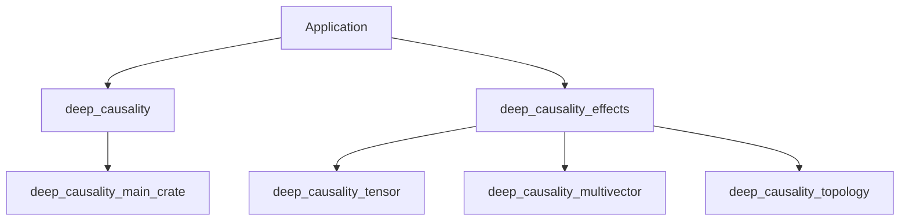

# DeepCausality Effects Crate Specification

## 1. Overview
The `deep_causality_effects` crate is a proposed new workspace member designed to solve the challenge of heterogeneous causal graphs. It introduces a unified type system (Sum Types/Enums) that allows the core `deep_causality` engine to process diverse data types (Floats, Bools, Tensors, MultiVectors) within a single graph structure.

## 2. Architectural Positioning

### 2.1 Dependency Graph

*Note: `deep_causality` (Core) does NOT depend on `deep_causality_effects`. It remains generic over `<I, O>`.*

### 2.2 Role
- **Core Crate**: Defines the interaction protocol via generics.
- **Effects Crate**: Defines the concrete data implementation for heterogeneous use cases.

## 3. The `EffectData` Enum Strategy

To manage the complexity of combining algebraic types, the `EffectData` enum follows an **"Atomic + Escape Hatch"** design pattern. It prioritizes flat, atomic variants for common use cases while providing a type-erased escape hatch for complex, nested structures.

```rust
use deep_causality_tensor::CausalTensor;
use deep_causality_multivector::MultiVector;
// use deep_causality_topology::Topology; 
use std::any::Any;

pub enum EffectData {
    // --- Primitives ---
    Bool(bool),
    Float(f64),
    Int(i64),
    
    // --- Standard Collections ---
    /// Allows recursive heterogeneity (List of Floats, Bools, etc.)
    Vector(Vec<EffectData>), 
    
    // --- Algebraic Types (First-Class Citizens) ---
    // These are fixed to f64 for simplicity in 95% of cases.
    MultiVector(MultiVector<f64>),
    Tensor(CausalTensor<f64>),
    
    // --- Escape Hatch for Complex Combinations ---
    // Use for Tensor<MultiVector>, Topology<Tensor>, etc.
    Custom(Box<dyn Any + Send + Sync>),
}
```

## 4. Implementation Requirements

### 4.1 Trait Implementations
The `EffectData` enum must implement common traits to be useful in the causal graph:
- `Clone` (Required for state propagation)
- `Debug` (Required for logging)
- `Default` (Required for initialization)
- `PartialEq` (Desirable for change detection)

### 4.2 Conversion Traits
Implement `From<T>` for all variant types to allow ergonomic construction:
```rust
impl From<f64> for EffectData {
    fn from(val: f64) -> Self { EffectData::Float(val) }
}
impl From<CausalTensor<f64>> for EffectData { ... }
```

### 4.3 Helper Methods
Provide utility methods to safely downcast the `Custom` variant:
```rust
impl EffectData {
    pub fn as_custom<T: Any>(&self) -> Option<&T> {
        if let EffectData::Custom(b) = self {
            b.downcast_ref::<T>()
        } else {
            None
        }
    }
}
```

## 5. Migration Strategy
1.  **Create Crate**: Initialize `deep_causality_effects` in the workspace.

