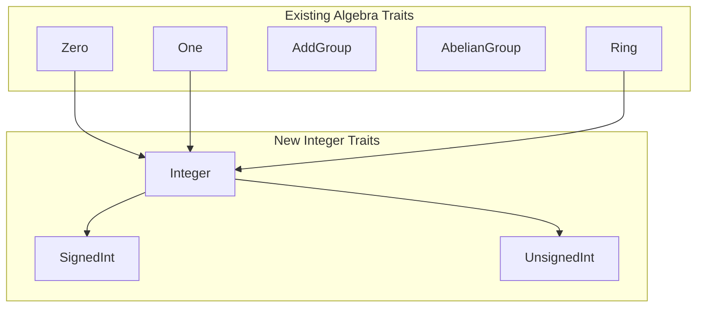

# Integer Traits: Type-Safe Abstraction Over Primitive Integer Types

* **Product Area:** Deep Causality
* **Crate:** `deep_causality_num`
* **Status:** Draft
* **Target:** Q1 2026
* **Classification:** Core Infrastructure
* **Owner:** DeepCausality Authors

---

## 1. Executive Summary

This document specifies the **Integer**, **SignedInt**, and **UnsignedInt** traits for abstracting over Rust's
primitive integer types. These traits enable generic programming over integer types while preserving type safety and
leveraging the existing algebraic trait hierarchy.

### 1.1 Problem Statement

Currently, `deep_causality_num` provides rich algebraic abstractions for floating-point types (`Field`, `RealField`,
`Float`) but lacks equivalent unified abstractions for integer types. Users who need to write generic code over
integers must:

- Use `num-traits` crate (external dependency, against project philosophy)
- Manually specify bounds like `i32 + std::ops::Add + ...` for each function
- Lose access to integer-specific operations (bit manipulation, checked arithmetic)

### 1.2 Solution

Introduce three traits:

| Trait | Covers | Description |
|-------|--------|-------------|
| **Integer** | All primitive integers | Common operations for signed and unsigned |
| **SignedInt** | `i8`, `i16`, `i32`, `i64`, `i128`, `isize` | Signed-specific: negation, `abs`, `signum` |
| **UnsignedInt** | `u8`, `u16`, `u32`, `u64`, `u128`, `usize` | Unsigned-specific: guaranteed non-negative |

### 1.3 Design Principles

1. **Zero External Dependencies:** No macros, no unsafe, no external crates
2. **Algebraic Integration:** Integers implement `Ring` (not `Field`, since no multiplicative inverse)
3. **Blanket Implementations:** Default trait methods where possible
4. **Const Support:** Associated constants for `MIN`, `MAX`, `BITS`

---

## 2. Architecture

### 2.1 Trait Hierarchy



### 2.2 Algebraic Properties of Integers

Integers form a **Commutative Ring** (also called an "Integral Domain" when excluding zero divisors):

| Property | Formula | Status |
|----------|---------|--------|
| Additive Closure | $a + b \in \mathbb{Z}$ | ✅ (modular for fixed-width) |
| Additive Identity | $a + 0 = a$ | ✅ `Zero` trait |
| Additive Inverse | $a + (-a) = 0$ | ✅ Signed only |
| Additive Commutativity | $a + b = b + a$ | ✅ |
| Multiplicative Closure | $a \times b \in \mathbb{Z}$ | ✅ (modular for fixed-width) |
| Multiplicative Identity | $a \times 1 = a$ | ✅ `One` trait |
| Multiplicative Inverse | $a \times a^{-1} = 1$ | ❌ Not in $\mathbb{Z}$ |
| Multiplicative Commutativity | $a \times b = b \times a$ | ✅ |
| Distributivity | $a \times (b + c) = ab + ac$ | ✅ |

> [!IMPORTANT]
> Integers implement `Ring` but **not** `Field` because only $\pm 1$ have multiplicative inverses in $\mathbb{Z}$.

---

## 3. File Structure

### 3.1 New Files to Create

| File Path | Description |
|-----------|-------------|
| `deep_causality_num/src/integer/mod.rs` | Module definition and exports |
| `deep_causality_num/src/integer/integer.rs` | `Integer` trait definition |
| `deep_causality_num/src/integer/integer_impl.rs` | Implementations for all primitive types |
| `deep_causality_num/src/integer/signed.rs` | `SignedInt` trait definition |
| `deep_causality_num/src/integer/signed_impl.rs` | Implementations for `i8`–`i128`, `isize` |
| `deep_causality_num/src/integer/unsigned.rs` | `UnsignedInt` trait definition |
| `deep_causality_num/src/integer/unsigned_impl.rs` | Implementations for `u8`–`u128`, `usize` |
| `deep_causality_num/tests/integer/mod.rs` | Test module |
| `deep_causality_num/tests/integer/integer_tests.rs` | Integer trait tests |
| `deep_causality_num/tests/integer/signed_tests.rs` | SignedInt tests |
| `deep_causality_num/tests/integer/unsigned_tests.rs` | UnsignedInt tests |

### 3.2 Files to Modify

| File Path | Changes |
|-----------|---------|
| `deep_causality_num/src/lib.rs` | Add `pub mod integer;` and re-exports |
| `deep_causality_num/README.md` | Document new traits in summary |
| `deep_causality_num/README_ALGEBRA_TRAITS.md` | Add integer section |

---

## 4. Technical Specification

### 4.1 Integer Trait

**Location:** `deep_causality_num/src/integer/integer.rs`

```rust
use crate::{One, Ring, Zero};
use core::ops::{BitAnd, BitOr, BitXor, Not, Shl, Shr};

/// A trait for primitive integer types.
///
/// This trait abstracts over both signed and unsigned integers, providing
/// common operations and constants. It extends `Ring` from the algebraic
/// hierarchy, reflecting that integers form a ring under addition and
/// multiplication.
///
/// # Mathematical Background
///
/// The integers $\mathbb{Z}$ form a **Euclidean Domain**:
/// - A commutative ring with identity
/// - Division with remainder is well-defined: $a = bq + r$ where $0 \le r < |b|$
/// - This enables the Euclidean algorithm for GCD
///
/// Fixed-width integers in computers are technically $\mathbb{Z}/2^n\mathbb{Z}$
/// (integers modulo $2^n$), but overflow behavior varies by build configuration.
pub trait Integer:
    Ring
    + Ord
    + Copy
    + Sized
    + BitAnd<Output = Self>
    + BitOr<Output = Self>
    + BitXor<Output = Self>
    + Not<Output = Self>
    + Shl<u32, Output = Self>
    + Shr<u32, Output = Self>
{
    /// The minimum value representable by this type.
    const MIN: Self;

    /// The maximum value representable by this type.
    const MAX: Self;

    /// The size of this type in bits.
    const BITS: u32;

    /// Returns the number of ones in the binary representation.
    fn count_ones(self) -> u32;

    /// Returns the number of zeros in the binary representation.
    fn count_zeros(self) -> u32;

    /// Returns the number of leading zeros in the binary representation.
    fn leading_zeros(self) -> u32;

    /// Returns the number of trailing zeros in the binary representation.
    fn trailing_zeros(self) -> u32;

    /// Reverses the byte order of the integer.
    fn swap_bytes(self) -> Self;

    /// Converts from big-endian to native byte order.
    fn from_be(x: Self) -> Self;

    /// Converts from little-endian to native byte order.
    fn from_le(x: Self) -> Self;

    /// Converts to big-endian byte order.
    fn to_be(self) -> Self;

    /// Converts to little-endian byte order.
    fn to_le(self) -> Self;

    /// Checked addition. Returns `None` on overflow.
    fn checked_add(self, rhs: Self) -> Option<Self>;

    /// Checked subtraction. Returns `None` on underflow.
    fn checked_sub(self, rhs: Self) -> Option<Self>;

    /// Checked multiplication. Returns `None` on overflow.
    fn checked_mul(self, rhs: Self) -> Option<Self>;

    /// Checked division. Returns `None` if `rhs == 0`.
    fn checked_div(self, rhs: Self) -> Option<Self>;

    /// Checked remainder. Returns `None` if `rhs == 0`.
    fn checked_rem(self, rhs: Self) -> Option<Self>;

    /// Saturating addition. Clamps at `MAX` or `MIN`.
    fn saturating_add(self, rhs: Self) -> Self;

    /// Saturating subtraction. Clamps at `MAX` or `MIN`.
    fn saturating_sub(self, rhs: Self) -> Self;

    /// Saturating multiplication. Clamps at `MAX` or `MIN`.
    fn saturating_mul(self, rhs: Self) -> Self;

    /// Wrapping addition. Wraps around on overflow.
    fn wrapping_add(self, rhs: Self) -> Self;

    /// Wrapping subtraction. Wraps around on underflow.
    fn wrapping_sub(self, rhs: Self) -> Self;

    /// Wrapping multiplication. Wraps around on overflow.
    fn wrapping_mul(self, rhs: Self) -> Self;

    /// Raises self to the power `exp`, using exponentiation by squaring.
    fn pow(self, exp: u32) -> Self;

    /// Calculates the quotient of Euclidean division.
    fn div_euclid(self, rhs: Self) -> Self;

    /// Calculates the remainder of Euclidean division.
    ///
    /// The result satisfies `0 <= r < |rhs|` for all inputs.
    fn rem_euclid(self, rhs: Self) -> Self;
}
```

### 4.2 SignedInt Trait

**Location:** `deep_causality_num/src/integer/signed.rs`

```rust
use crate::Integer;
use core::ops::Neg;

/// A trait for signed integer types.
///
/// Extends `Integer` with operations specific to signed types, such as
/// absolute value, signum, and negation.
///
/// # Mathematical Background
///
/// Signed integers represent $\mathbb{Z}$ (the integers) within a bounded range.
/// They support the additive inverse operation ($-a$), forming a true
/// additive group (unlike unsigned integers).
pub trait SignedInt: Integer + Neg<Output = Self> {
    /// Returns the absolute value of the integer.
    ///
    /// # Overflow
    /// For `MIN` values (e.g., `i8::MIN = -128`), the absolute value cannot
    /// be represented and will panic in debug mode or wrap in release.
    /// Use `checked_abs` for safe handling.
    fn abs(self) -> Self;

    /// Returns the sign of the integer.
    ///
    /// - `-1` if negative
    /// - `0` if zero
    /// - `1` if positive
    fn signum(self) -> Self;

    /// Returns `true` if the integer is negative.
    fn is_negative(self) -> bool;

    /// Returns `true` if the integer is positive.
    fn is_positive(self) -> bool;

    /// Checked absolute value. Returns `None` for `MIN`.
    fn checked_abs(self) -> Option<Self>;

    /// Checked negation. Returns `None` for `MIN`.
    fn checked_neg(self) -> Option<Self>;

    /// Saturating absolute value. Returns `MAX` for `MIN`.
    fn saturating_abs(self) -> Self;

    /// Wrapping absolute value. Wraps `MIN` to `MIN`.
    fn wrapping_abs(self) -> Self;

    /// Wrapping negation.
    fn wrapping_neg(self) -> Self;
}
```

### 4.3 UnsignedInt Trait

**Location:** `deep_causality_num/src/integer/unsigned.rs`

```rust
use crate::Integer;

/// A trait for unsigned integer types.
///
/// Extends `Integer` with operations and guarantees specific to unsigned types.
///
/// # Mathematical Background
///
/// Unsigned integers represent $\mathbb{N}_0$ (natural numbers including zero)
/// within a bounded range. They do NOT form an additive group since subtraction
/// can produce values outside the representable range (negative numbers).
///
/// Under modular arithmetic, they form $\mathbb{Z}/2^n\mathbb{Z}$, a ring.
pub trait UnsignedInt: Integer {
    /// Returns `true`. Provided for API consistency with `SignedInt`.
    #[inline]
    fn is_non_negative(self) -> bool {
        true
    }

    /// Returns the value unchanged. Provided for API consistency.
    ///
    /// For unsigned types, `abs(x) == x` always.
    #[inline]
    fn abs(self) -> Self {
        self
    }

    /// Calculates `self + rhs`, returning `None` if overflow would occur.
    ///
    /// This is an alias for `checked_add` for clarity.
    #[inline]
    fn checked_add_unsigned(self, rhs: Self) -> Option<Self> {
        self.checked_add(rhs)
    }

    /// Returns the next power of two greater than or equal to `self`.
    ///
    /// Returns `None` if the result would overflow.
    fn checked_next_power_of_two(self) -> Option<Self>;

    /// Returns `true` if `self` is a power of two.
    fn is_power_of_two(self) -> bool;

    /// Returns the smallest power of two greater than or equal to `self`.
    ///
    /// # Panics
    /// Panics if the result would overflow.
    fn next_power_of_two(self) -> Self;
}
```

### 4.4 Implementation Example

**Location:** `deep_causality_num/src/integer/integer_impl.rs`

```rust
use crate::Integer;

macro_rules! impl_integer {
    ($($t:ty)*) => ($(
        impl Integer for $t {
            const MIN: Self = <$t>::MIN;
            const MAX: Self = <$t>::MAX;
            const BITS: u32 = <$t>::BITS;

            #[inline] fn count_ones(self) -> u32 { <$t>::count_ones(self) }
            #[inline] fn count_zeros(self) -> u32 { <$t>::count_zeros(self) }
            #[inline] fn leading_zeros(self) -> u32 { <$t>::leading_zeros(self) }
            #[inline] fn trailing_zeros(self) -> u32 { <$t>::trailing_zeros(self) }
            #[inline] fn swap_bytes(self) -> Self { <$t>::swap_bytes(self) }
            #[inline] fn from_be(x: Self) -> Self { <$t>::from_be(x) }
            #[inline] fn from_le(x: Self) -> Self { <$t>::from_le(x) }
            #[inline] fn to_be(self) -> Self { <$t>::to_be(self) }
            #[inline] fn to_le(self) -> Self { <$t>::to_le(self) }
            #[inline] fn checked_add(self, rhs: Self) -> Option<Self> { <$t>::checked_add(self, rhs) }
            #[inline] fn checked_sub(self, rhs: Self) -> Option<Self> { <$t>::checked_sub(self, rhs) }
            #[inline] fn checked_mul(self, rhs: Self) -> Option<Self> { <$t>::checked_mul(self, rhs) }
            #[inline] fn checked_div(self, rhs: Self) -> Option<Self> { <$t>::checked_div(self, rhs) }
            #[inline] fn checked_rem(self, rhs: Self) -> Option<Self> { <$t>::checked_rem(self, rhs) }
            #[inline] fn saturating_add(self, rhs: Self) -> Self { <$t>::saturating_add(self, rhs) }
            #[inline] fn saturating_sub(self, rhs: Self) -> Self { <$t>::saturating_sub(self, rhs) }
            #[inline] fn saturating_mul(self, rhs: Self) -> Self { <$t>::saturating_mul(self, rhs) }
            #[inline] fn wrapping_add(self, rhs: Self) -> Self { <$t>::wrapping_add(self, rhs) }
            #[inline] fn wrapping_sub(self, rhs: Self) -> Self { <$t>::wrapping_sub(self, rhs) }
            #[inline] fn wrapping_mul(self, rhs: Self) -> Self { <$t>::wrapping_mul(self, rhs) }
            #[inline] fn pow(self, exp: u32) -> Self { <$t>::pow(self, exp) }
            #[inline] fn div_euclid(self, rhs: Self) -> Self { <$t>::div_euclid(self, rhs) }
            #[inline] fn rem_euclid(self, rhs: Self) -> Self { <$t>::rem_euclid(self, rhs) }
        }
    )*)
}

impl_integer! { i8 i16 i32 i64 i128 isize u8 u16 u32 u64 u128 usize }
```

**Location:** `deep_causality_num/src/integer/signed_impl.rs`

```rust
use crate::SignedInt;

macro_rules! impl_signed_int {
    ($($t:ty)*) => ($(
        impl SignedInt for $t {
            #[inline] fn abs(self) -> Self { <$t>::abs(self) }
            #[inline] fn signum(self) -> Self { <$t>::signum(self) }
            #[inline] fn is_negative(self) -> bool { <$t>::is_negative(self) }
            #[inline] fn is_positive(self) -> bool { <$t>::is_positive(self) }
            #[inline] fn checked_abs(self) -> Option<Self> { <$t>::checked_abs(self) }
            #[inline] fn checked_neg(self) -> Option<Self> { <$t>::checked_neg(self) }
            #[inline] fn saturating_abs(self) -> Self { <$t>::saturating_abs(self) }
            #[inline] fn wrapping_abs(self) -> Self { <$t>::wrapping_abs(self) }
            #[inline] fn wrapping_neg(self) -> Self { <$t>::wrapping_neg(self) }
        }
    )*)
}

impl_signed_int! { i8 i16 i32 i64 i128 isize }
```

**Location:** `deep_causality_num/src/integer/unsigned_impl.rs`

```rust
use crate::UnsignedInt;

macro_rules! impl_unsigned_int {
    ($($t:ty)*) => ($(
        impl UnsignedInt for $t {
            #[inline]
            fn checked_next_power_of_two(self) -> Option<Self> {
                <$t>::checked_next_power_of_two(self)
            }
            #[inline]
            fn is_power_of_two(self) -> bool {
                <$t>::is_power_of_two(self)
            }
            #[inline]
            fn next_power_of_two(self) -> Self {
                <$t>::next_power_of_two(self)
            }
        }
    )*)
}

impl_unsigned_int! { u8 u16 u32 u64 u128 usize }
```

---

## 5. Existing Trait Integration

The following traits are **already implemented** for primitive integers and will be leveraged:

| Trait | Location | Types |
|-------|----------|-------|
| `Zero` | `identity/zero_impl.rs` | `i8`–`i128`, `u8`–`u128`, `isize`, `usize` |
| `One` | `identity/one_impl.rs` | `i8`–`i128`, `u8`–`u128`, `isize`, `usize` |
| `ConstZero` | `identity/zero_impl.rs` | All primitive integers |
| `ConstOne` | `identity/one_impl.rs` | All primitive integers |
| `Associative` | `algebra/algebra_properties.rs` | `i8`–`i128`, `u8`–`u128` |
| `Commutative` | `algebra/algebra_properties.rs` | `i8`–`i128`, `u8`–`u128` |
| `Distributive` | `algebra/algebra_properties.rs` | `i8`–`i128`, `u8`–`u128` |

Since these traits exist, integers **automatically qualify** for:

- `AddMonoid` (via blanket impl, requires `Add + Zero`)
- `MulMonoid` (via blanket impl, requires `Mul + One + Associative`)
- `AddGroup` (via blanket impl for signed, requires `Add + Sub + Zero`)
- `AbelianGroup` (via explicit impl for `i8`–`i128`, `u8`–`u128` in `group_abelian.rs`)
- `Ring` (via blanket impl, requires `AbelianGroup + MulMonoid + Distributive`)

> [!NOTE]
> Unsigned integers do not form a true `AddGroup` under standard arithmetic since subtraction
> can underflow. However, under wrapping/modular semantics, they do form a group.

---

## 6. Use Cases

### 6.1 Generic Index Type

```rust
use deep_causality_num::{Integer, UnsignedInt};

fn allocate_buffer<I: UnsignedInt>(size: I) -> Vec<u8> {
    // Compile-time guarantee: I is non-negative
    let size_usize: usize = size.try_into().unwrap_or(usize::MAX);
    vec![0u8; size_usize]
}
```

### 6.2 Safe Arithmetic in Tensor Indexing

```rust
use deep_causality_num::Integer;

fn compute_flat_index<I: Integer>(indices: &[I], strides: &[I]) -> Option<I> {
    indices.iter()
        .zip(strides.iter())
        .try_fold(I::zero(), |acc, (&idx, &stride)| {
            idx.checked_mul(stride)?.checked_add(acc)
        })
}
```

### 6.3 Bit Manipulation for Sparse Tensors

```rust
use deep_causality_num::UnsignedInt;

fn next_aligned<I: UnsignedInt>(offset: I) -> I {
    let alignment = I::one() << 6; // 64-byte alignment
    (offset + alignment - I::one()) & !(alignment - I::one())
}
```

---

## 7. Verification Plan

### 7.1 Unit Tests

**Location:** `deep_causality_num/tests/integer/`

| Test File | Test Case | Description |
|-----------|-----------|-------------|
| `integer_tests.rs` | `test_constants` | Verify `MIN`, `MAX`, `BITS` for all types |
| `integer_tests.rs` | `test_checked_ops` | Verify `checked_add/sub/mul/div` return `None` on overflow |
| `integer_tests.rs` | `test_saturating_ops` | Verify clamping behavior |
| `integer_tests.rs` | `test_bit_ops` | Verify `count_ones`, `leading_zeros`, etc. |
| `signed_tests.rs` | `test_abs_signum` | Verify `abs`, `signum` for positive/negative/zero |
| `signed_tests.rs` | `test_min_abs_overflow` | Verify `checked_abs(MIN)` returns `None` |
| `unsigned_tests.rs` | `test_power_of_two` | Verify `is_power_of_two`, `next_power_of_two` |

### 7.2 Compile-Time Verification

Blanket impls will fail to compile if bounds are not met:

```rust
fn require_ring<T: Ring>() {}
fn require_integer<T: Integer>() {}

// This should compile:
require_ring::<i32>();
require_integer::<u64>();

// This should NOT compile (f64 is not Integer):
// require_integer::<f64>();
```

### 7.3 Test Commands

```bash
# Run all integer tests
cargo test -p deep_causality_num integer

# Run with overflow checks
RUSTFLAGS="-C overflow-checks=on" cargo test -p deep_causality_num integer

# Verify no-std compatibility
cargo build --no-default-features -p deep_causality_num
```

---

## 8. Open Questions

1. **`isize`/`usize` Inclusion:** Should these be included given their platform-dependent size?
   - **Recommendation:** Yes, they are essential for indexing.

2. **128-bit Integer Support:** Some platforms have limited support for `i128`/`u128`.
   - **Recommendation:** Include with feature flag if needed for embedded targets.

3. **Macro Usage:** The spec uses declarative macros for DRY implementations. Does this violate
   the "macro-free" philosophy?
   - **Recommendation:** Internal macros are acceptable if not exported. They reduce maintenance
     burden without affecting API ergonomics.

---

## 9. Migration Guide

1. **Add Module:**
   ```rust
   // In deep_causality_num/src/lib.rs
   pub mod integer;
   pub use integer::{Integer, SignedInt, UnsignedInt};
   ```

2. **Use in Generic Code:**
   ```rust
   // Before: Manual bounds
   fn foo<T: Add<Output=T> + Sub<Output=T> + Zero + One + Copy + Ord>(x: T) { ... }

   // After: Unified trait
   fn foo<T: Integer>(x: T) { ... }
   ```

3. **Migrate from `num-traits`:**
   ```rust
   // Before (with num-traits)
   use num_traits::{PrimInt, Signed};

   // After
   use deep_causality_num::{Integer, SignedInt};
   ```
