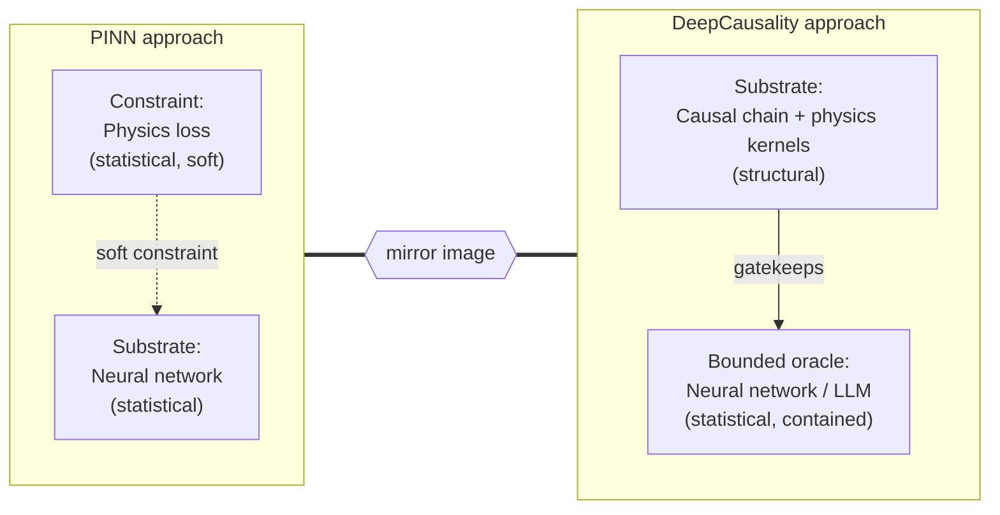

[//]: # (SPDX-License-Identifier: CC-BY-4.0)

*And what a structurally different approach looks like.*

**Short answer.** Large language models, and neural networks generally, cannot do physics because a neural network generalizes by interpolating within its training distribution, while a physical law is defined by predictions that hold *outside* any training distribution. The two are doing opposite things. Physics-informed neural networks (PINNs) tried to bridge the gap by imposing physics as a soft constraint on a correlational substrate. The bridge fails for structural reasons. The fix is to invert the architecture: make physics the structural substrate, and use the neural network as a bounded oracle contained inside it.

Physics-informed neural networks were supposed to be the bridge between data-driven AI and the laws of physics. Train a network, add the PDE residual to the loss, let gradient descent find a solution that respects conservation of energy, Maxwell's equations, the Schrödinger equation, whatever you need.

It does not work.

The retrospectives at NeurIPS and ICLR over the last two years have been polite about it. The papers use language like "convergence challenges on stiff systems" and "soft-constraint violations under distribution shift." Translation: when the physics gets hard, the network ignores the physics.

## The symptom: where PINNs fail

A physics-informed neural network is a neural network trained with two loss terms. The first is the usual data-fit term: predicted output should match observed output. The second is a physics-residual term: predicted output, when plugged into the governing equation, should produce zero residual. The network learns from data where data is available, and it learns from physics where data is sparse. Best of both worlds. At least, that was the idea.

The failure modes are, by now, well-documented:

1. **Stiff systems lose the physics.** When the PDE involves multiple timescales (fast and slow dynamics together), the gradient of the physics-residual loss becomes ill-conditioned. The optimizer finds it cheaper to fit the data and leave the physics residual nonzero. The trained network produces output that looks plausible and violates conservation laws.

2. **Out-of-distribution prediction collapses.** The network is asked to extrapolate to a regime not seen in training, say a higher Reynolds number or a different boundary condition. The data-fit term is silent (no data to fit). The physics term should pick up the slack. It does not. The network produces output that interpolates the training distribution; in other words, the network hallucinates physics that simply does not exist.

3. **The loss landscape punishes caring about physics.** Several recent analyses have shown that increasing the weight on the physics term often makes training worse, not better. The loss landscape develops sharp ridges. The practical fix is to down-weight the physics term, which defeats the entire purpose.

## The mechanism: why a soft constraint cannot enforce a hard law

Why does this happen? Because physics is being imposed as a *soft constraint* on a fundamentally *correlational substrate*.

A neural network is, at its core, a high-dimensional interpolator over a training distribution. Its representations are statistical: weight matrices that capture which combinations of inputs co-occur with which outputs. There is no representation of *necessity*. The network does not know that energy is conserved; it knows that, in its training data, the inputs and outputs are consistent with energy conservation, most of the time.

When you add the physics-residual loss, you are asking the optimizer to find weights such that, on the training distribution, the network's output satisfies the equation. The optimizer dutifully does this. It does not internalize the equation. It finds a region of weight space where the equation happens to be satisfied for the inputs it has seen.

Take the network outside that region, and the constraint evaporates. Not because the network has forgotten the equation. The equation was never represented. Only a region of weight space was found where the equation incidentally held.

This is the structural problem. The substrate is statistical, the constraint is statistical, and at the margins the substrate wins, because that is what optimization does. It optimizes.

## The diagnosis: laws hold where data does not

A physical law is a claim about what must hold *outside* any particular training distribution. That is what makes it a law. Newton's second law does not say "force tends to equal mass times acceleration on data sampled between 1687 and 1850." It says force *equals* mass times acceleration, full stop.

Neural networks generalize by interpolating within their training distribution. Physical laws are defined by the predictions they make *outside* their training distribution. The two are doing opposite things.

This is also, incidentally, why large language models cannot do physics in any deep sense. An LLM is a much larger neural network with a much larger training distribution, but the same structural property holds: it generalizes by interpolating over the distribution it was trained on. Ask it for the next token in a sentence about classical mechanics and it will produce a plausible token. Ask it to predict a physical quantity in a regime that does not appear in its training corpus and the prediction will be confidently wrong.

A bigger model does not fix this. A better fine-tune does not fix this. The mismatch is between *what a neural network does* and *what a physical law is*. Neither side of the mismatch can be moved by scaling. The companion argument about reasoning is in [Why Do LLMs Struggle With Causality?](/blog/why-llms-struggle-with-causality/), and the parallel argument about deployment failures is in [Why Is Distribution Shift a Problem in AI?](/blog/why-is-distribution-shift-a-problem-in-ai/).

## The inversion: physics as substrate, network as oracle

In the PINN approach, the neural network is the substrate and physics is a soft constraint imposed on it. The inversion is to make physics the substrate, and let the neural network (or LLM) operate as a bounded oracle *inside* the substrate.

Concretely, in the DeepCausality framework, a system is built as a causal chain of Causaloids. Each Causaloid takes a propagating effect as input and returns a propagating effect as output. The framework is described elsewhere in detail (see the [Core Concepts](https://github.com/deepcausality-rs/deep_causality/blob/main/deep_causality/docs/CORE.md) docs). For this post, the relevant property is: the chain is composed of deterministic nodes whose mathematical structure is enforced at the type level. Likewise, physics is respected at each stage.

Most nodes in the chain are deterministic. They are physics: Maxwell's equations, Schrödinger evolution, Lorentz transforms, heat diffusion on a discrete manifold. Their inputs and outputs have specific types. They compose only if their types align. The propagating effect that leaves one node has to be acceptable to the next node, or the chain refuses to compile.

A subset of nodes can be neural. A Causaloid can wrap an LLM call. The LLM is asked a question, returns a value, the value is wrapped in a propagating effect, and the effect is handed to the next node in the chain.

If the LLM hallucinates Newton's sixth law, the next physics node either rejects the propagated effect (the value does not satisfy the precondition of the next kernel) or the type system refuses to compose (the value is not of the expected type). The hallucination cannot propagate more than one node downstream. It cannot violate the physics encoded in the substrate, because the substrate is the gatekeeper.

In deep causality, physics is encoded in the causal chain itself, and a neural component is a contained oracle inside one cell of the chain.

## The mirror image

In PINN, physics is a soft constraint on a correlational substrate. The constraint is statistical, the substrate is statistical, and at the margins the substrate wins.

In the causal approach, correlation is a bounded oracle inside a structural substrate. The constraint is structural, the substrate is structural, and the neural component is contained by the structure rather than asked to internalize it.

In that sense, deep causality fundamentally inverts the PINN approach.

## What does this architecture buy?

Three things, concretely.

**Hallucination containment.** The LLM can still hallucinate. It will, in fact, hallucinate just as often as it would on its own. The difference is that the hallucinations do not propagate. A wrong value from the LLM gets rejected by the next physics node, or the rejection bubbles up through the propagating-effect monad as an error, with a full audit trail of which node rejected what and why. The system fails loudly and the failure mode is documented transparently in its log trail.

**Regime awareness.** Because the physics is encoded in types and composition rules, regime changes are explicit. A node parameterized on Newtonian assumptions has a different type from a node parameterized on relativistic assumptions. Switching regimes is a structural change in the chain, not a silent shift in the network's behavior. The system knows when it has crossed a regime boundary because the chain itself has to be reconfigured to cross it. In fact, the DeepCausality Project has a [code example](https://github.com/deepcausality-rs/deep_causality/tree/main/examples/physics_examples/event_horizon_probe) that automatically detects the disintegration of the Newtonian physics regime and switches over to fully relativistic physics. The deeper structural reason is in [Why Correlation Breaks Under Regime Change](/blog/why-correlation-breaks-under-regime-change/).

**Counterfactual reasoning.** Because the chain is a monadic structure with explicit intervention semantics, you can ask counterfactual questions. Replace the value at node *k* with a forced value, propagate the rest of the chain, compare against the factual run. This is Pearl's do-operator, applied to a chain in which the propagating effects are physical quantities. The neural component does not lose this property; it inherits it, because it sits inside the chain.

## A worked example: recovering Earth's mass from atomic clocks

Galileo, the European satellite navigation system, broadcasts atomic-clock signals continuously. Each satellite carries clocks accurate to a few nanoseconds per day. The clocks tick slightly faster on orbit than they would on the ground, because of general relativistic time dilation. The faster tick rate is a function of orbital altitude, which is a function of the satellite's gravitational potential relative to Earth, which is a function of GM, Earth's gravitational parameter.

When you solve the Einstein field equations forward, you determine the degree of spacetime curvature given an orbital mass. When you invert the Einstein field equations, in effect solving them backwards, you recover the orbital mass from the spacetime curvature. In our solar system we operate in the weak-field limit, which means there is no gravitational force strong enough to bend space itself; measurable spacetime curvature collapses to just time dilation. The difference in time dilation, through the inverted Einstein field equations, determines the GM constant. Dividing the GM constant by the known gravity value yields the planetary mass from time measurements alone.

Given the observed clock-rate offset across different altitudes of the Galileo constellation, you can recover GM. The DeepCausality project includes a [worked example of this recovery](https://github.com/deepcausality-rs/deep_causality/tree/main/examples/chronometric_examples/gm_recovery); one week of broadcast clock data, propagated through a chain of relativistic effects, returns GM and the planetary mass of Earth to within a 0.2 percent error margin. For a much larger sample size with a significantly lower error margin, see the [full chronodynamics experiment](https://github.com/causalcenter/chronodynamics) at the [Center for Dynamic Causality](https://www.causalcenter.com).

## Closing thoughts

Unmentioned above is that the propagating-process pattern is rooted in Whitehead's process philosophy, which establishes a metaphysics that allows for quantum-native and relativistic-native representation. The DeepCausality project fully inherits this property and can therefore represent relativistic and quantum problems in a straightforward way. DeepCausality also applies to a broad variety of dynamic-system challenges. The project has working code examples for avionics, medicine, mathematics, and several branches of physics. Whenever complex dynamic systems need to be built, DeepCausality provides a working foundation that natively represents complex dynamics.

Further reading: 
* [Why Is Correlation Not Causation?](/blog/why-is-correlation-not-causation/) 
* [Why Correlation Breaks Under Regime Change](/blog/why-correlation-breaks-under-regime-change/) 
* [Why Do LLMs Struggle With Causality?](/blog/why-llms-struggle-with-causality/)

## About DeepCausality

[DeepCausality](https://www.deepcausality.com/) is a dynamic-causality framework that enables fast, deterministic, context-aware causal reasoning in Rust. The project is hosted at the Linux Foundation for AI & Data. Please give us a [star on GitHub](https://github.com/deepcausality-rs/deep_causality).
