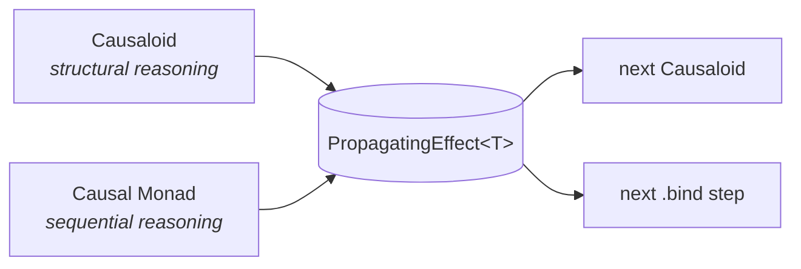
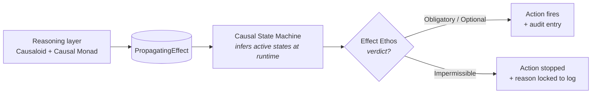

Computational causality and deep learning solve different problems. Deep learning excels at pattern matching from large data: object detection, fraud detection, next-token prediction in large language models. These systems infer from statistical co-occurrence in the training distribution, and that is exactly the right tool for many problems. For other problems — the ones where [correlation is not causation](/blog/why-is-correlation-not-causation/) and the deployment regime can [shift away from training](/blog/why-is-distribution-shift-a-problem-in-ai/) — a different substrate is needed.

Computational causality is that substrate. It gives you three things a purely correlational system cannot:

- **Deterministic reasoning**: same input, same output. The system gives the same answer on Tuesday that it gave on Monday.
- **Probabilistic reasoning**: explicit odds, explicit confidence. The system tells you not just *what* it concluded but *how sure* it is.
- **Full explainability**: a logical line of reasoning. You can ask the system "why" and get a structured answer.

These properties matter in regulated and high-stakes domains: medicine, finance, robotics, avionics, industrial control. In those domains, a regulator, an operator, or a courtroom is going to ask why a decision was made, and here, an audit trail of deterministic reasoning becomes critical.

Deep learning and DeepCausality are complementary methodologies with different strengths that compose well in a single system. Deep learning is a strong choice for perception: object recognition, anomaly detection in raw signals, embeddings of unstructured text. DeepCausality is a strong choice for dynamic reasoning with a verifiable audit trail.

Consider a drone entering a tunnel. A deep-learning vision system handles perception: it recognizes the tunnel mouth from the camera feed. When GPS lock is lost a moment later, a classical finite state machine could switch to dead-reckoning — but only if that transition was anticipated at design time. Real flight encounters combinations the design-time state space does not enumerate: GPS loss *and* low battery *and* a passenger-corridor restriction *and* deteriorating wind, all at once. DeepCausality reasons over the propagating effect of those signals at runtime, asks the Effect Ethos whether the proposed fallback (e.g., immediate landing on a permitted surface) is permissible under the current operating rules, and emits an audit trail explaining the decision. A finite state machine cannot represent the permissibility check, cannot infer states that were not enumerated up front, and produces no audit trail beyond its transition log. Each method plays to its strengths, and either can feed the other depending on what the system requires.

## What makes DeepCausality unique

Most causality frameworks pick one paradigm. [Pearl's Structural Causal Models](https://en.wikipedia.org/wiki/Causal_model) pick a graph. [Granger causality](https://en.wikipedia.org/wiki/Granger_causality) and the [Rubin causal model](https://en.wikipedia.org/wiki/Rubin_causal_model) pick a sequence. [State-space models](https://en.wikipedia.org/wiki/State-space_representation) and control theory pick a process. Each is sound on its own ground, and each pays for the other paradigms through escape hatches, glue layers, or external orchestration. The price shows up when a real system needs the structural reasoning, the sequential reasoning, and the stateful threading in one inference path. Then you spend more time gluing models together than reasoning about the problem.

DeepCausality collapses those paradigms into one carrier: the [propagating effect](/docs/concepts/effect-propagation-process/).

The library has two reasoning primitives that emit the same propagating-effect type:

- The **[Causaloid](/docs/concepts/causaloid/)** handles structural reasoning and composes isomorphic-recursively. A Singleton Causaloid, a collection of Causaloids, and a graph of Causaloids all nest into each other. A collection of causaloids nests into a singleton causaloid, which then becomes a node in a causaloid graph. The graph itself might be a node into a larger causaloid graph.

- The **[Causal Monad](/docs/concepts/causal-monad/)** handles sequential reasoning. `pure` lifts a value into a chain; `bind` chains the next step; `intervene` rewrites a value mid-chain for counterfactual analysis. The chain accumulates an audit log automatically and short-circuits cleanly on error.

Because both primitives return the same propagating-effect type, you can take a Causaloid's verdict and `.bind` directly onto it. You can run a Causal Monad bind chain and feed its result into a Causaloid. The boundary between "structural reasoning" and "sequential reasoning" moves as the problem evolves. Instead of picking one, two, or more frameworks and wiring them together, you just choose one framework and pick the modality relative to the problem you're solving.

The same carrier covers two reasoning regimes. The non-Markovian `PropagatingEffect<T>` is the simpler case where each step depends only on its inputs and rules. The Markovian `PropagatingProcess<T, S, C>` carries state and context through every step. Both are aliases of the same underlying 5-arity type, so promoting a non-Markovian chain into a Markovian one is one constructor call rather than a rewrite.

The avionics [flight envelope monitor](https://github.com/deepcausality-rs/deep_causality/tree/main/examples/avionics_examples/flight_envelope_monitor) runs a Causaloid Collection over five sensor-health checks, a three-step Causal Monad bind-chain for state estimation, and a Causaloid hypergraph of six envelope protections, all threading through one `PropagatingProcess<T, FlightState, AircraftConfig>` with state and audit log carried across every stage. The same PropagatingEffect supports the physics, medicine, and distributed-systems examples in the repository.

The Causaloid alone gives you structure. The Causal Monad alone gives you sequencing. Neither would deliver the multi-domain composition the examples show. The fact that both emit the same type, that both can be lifted between Markovian and non-Markovian forms, and that they nest freely, is the move that makes DeepCausality unique.

### From reasoning to action

Reasoning composition is only half of the story. DeepCausality enables reasoning based action with two further primitives:

- The **[Causal State Machine (CSM)](/docs/concepts/csm/)** is the bridge from inference to the outside world. It reads the propagating effect produced by the reasoning layer, evaluates which of its registered causal states have become active, and proposes the action linked to each active state. The state space is inferred at runtime rather than enumerated at design time, which is how the CSM avoids the limitation of a classical finite state machine.

- The **[Effect Ethos](/docs/concepts/effect-ethos/)** is a programmable safety guardrail above the CSM. Every action the CSM would otherwise fire is intercepted by the Ethos and evaluated against an immutable graph of computable norms. The Ethos returns a verdict: `Obligatory`, `Impermissible`, or `Optional` with an associated cost. Based on the verdict, the proposed CSM action may execute or get stopped out. When it gets stopped out, the reason from the Effect Ethos is locked together with the outcome, so that in a subsequent audit one sees why the action was stopped, what its line of reasoning was, what the last proposed action was, and why it was stopped.

The combination matters most in the dynamic and emergent regimes. When the underlying reasoning is fully deterministic, the Ethos is unnecessary and the CSM can fire directly. When the causal structure itself evolves at runtime, static verification of the reasoning is no longer feasible, and the Ethos becomes the layer that restores verifiability at the action boundary. Whether the inference behind a proposed action was statically provable or emerged at runtime, the action only leaves the system if the Ethos says it is permissible under its encoded ethos.

## Where to go from here

DeepCausality treats causality itself as a dynamic process. The [next page](/docs/overview/the-problem/) explains what that means in practice, and the [page after that](/docs/overview/core-idea/) gives you the single idea on which the library is built.

### Further reading

Conceptual deep-dives in this documentation:

- [Causaloid](/docs/concepts/causaloid/) — structural reasoning primitive
- [Causal Monad](/docs/concepts/causal-monad/) — sequential reasoning primitive
- [Effect propagation process](/docs/concepts/effect-propagation-process/) — the `PropagatingEffect` carrier
- [Causal State Machine](/docs/concepts/csm/) — runtime-inferred state with action proposal
- [Effect Ethos](/docs/concepts/effect-ethos/) — programmable permissibility layer
- [Dynamic causality](/docs/concepts/dynamic-causality/) — how the substrate handles regime change

Background on why correlation-based systems break down in practice:

- [Why is correlation not causation?](/blog/why-is-correlation-not-causation/) — the four mechanisms
- [Why is distribution shift a problem in AI?](/blog/why-is-distribution-shift-a-problem-in-ai/) — silent failures on out-of-distribution inputs
- [Why correlation breaks under regime change](/blog/why-correlation-breaks-under-regime-change/) — sign reversal, magnitude collapse, spurious appearance
- [Why do LLMs struggle with causality?](/blog/why-llms-struggle-with-causality/) — Pearl's hierarchy and where token predictors sit
- [Why LLMs can't do physics](/blog/why-llms-cant-do-physics/) — the structural inversion DeepCausality applies

External references on the foundational frameworks DeepCausality unifies:

- [Pearl's Structural Causal Models](https://en.wikipedia.org/wiki/Causal_model) ([book](https://bayes.cs.ucla.edu/BOOK-2K/))
- [Granger causality](https://en.wikipedia.org/wiki/Granger_causality)
- [Rubin causal model](https://en.wikipedia.org/wiki/Rubin_causal_model)
- [State-space representation](https://en.wikipedia.org/wiki/State-space_representation)
